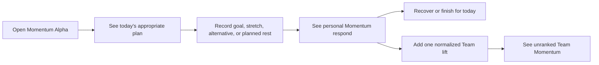

# Momentum Alpha implementation plan

Status: Local prototype implemented; owner review pending

Prepared: 2026-08-20

Review target: local mock-player build before any push or production release

## Progress

- [x] Define the alternate-application boundary and deletion test.
- [x] Add failing domain and player-flow tests.
- [x] Implement the namespaced shell and Today flow.
- [x] Implement recovery, rest, history-only extras, Team, and Me.
- [x] Complete repository verification and open the local review build.
- [ ] Apply owner feedback before choosing a beta deployment topology.

## 10,000-foot view

Build Momentum as a second player application inside the existing frontend,
not as a collection of conditionals scattered through Classic Alpha. A player
enters the alternate experience from **Me**, stays inside a namespaced
Momentum shell, and can return to Classic Alpha from Momentum's own **Me**
screen.

The alternate application reduces the primary navigation to three destinations:

1. **Today** — personal Momentum, today's appropriate plan, one check-in, and
   safe recovery or closure.
2. **Team** — one unranked Team Momentum surface using aggregate,
   normalized plan-following only.
3. **Me** — private history, the experience switch, and local-only review
   controls.

Authentication and current-player identity remain shared infrastructure.
Momentum Alpha owns its shell, navigation, content, mock plan, state,
persistence, domain rules, components, and styling. It does not use Classic
Alpha's Home, Log, Team, Leaders, or training state provider.

## Product outcome

A mock player should be able to sign in locally and understand one loop without
instruction:



The goal is a complete success. Stretch is optional. A demanding workout leads
to recovery rather than another hard challenge. Later activity may be kept in
private history, but it does not keep moving personal or Team Momentum.

## Application boundary

### Shared on purpose

- root document metadata and global reset;
- player authentication and session handling;
- current-player identity and saved avatar configuration;
- the backend proxy boundary, although this prototype does not add Momentum
  endpoints;
- reserved route constants.

### Owned by Momentum Alpha

- every route below `/momentum-alpha`;
- its three-item responsive application shell;
- all player-facing copy for the alternate experience;
- mock prescription and Team projection data;
- Momentum effects, caps, and idempotency rules;
- device-local prototype persistence under its own versioned key;
- Today, check-in, recovery, private history, Team, and Me presentation;
- all alternate-experience CSS.

### Integration points

Only two Classic files should know the alternate application exists:

1. `app/state/auth-context.tsx` chooses the Momentum shell boundary for the
   `/momentum-alpha` namespace and does not mount Classic training state there.
2. `app/me/page.tsx` renders one contained experience-switch card.

The shared route constants name the namespace. No Classic screen branches on a
Momentum feature flag, day state, completion state, or Momentum value.

### Deletion test

Removing Momentum Alpha should require:

1. deleting `app/momentum-alpha/`;
2. deleting the small Classic Me switch component and its render call;
3. removing the namespace constant and the single shell-boundary condition.

Classic routes and domain behavior should then compile without replacement
components, migrations, or data repair.

## Proposed file tree

```text
app/
├── content/
│   └── routes.ts                         # one shared namespace literal
├── me/
│   ├── MomentumAlphaEntry.tsx            # isolated Classic → Momentum seam
│   └── page.tsx                          # renders the entry card
├── momentum-alpha/
│   ├── components/
│   │   ├── MomentumAlphaShell.tsx        # alternate chrome + three-item nav
│   │   ├── MomentumMe.tsx                # profile, history, switch back
│   │   ├── MomentumTeam.tsx              # aggregate, unranked team view
│   │   ├── MomentumToday.tsx             # complete daily loop
│   │   └── MomentumTrail.tsx             # shared personal/team visual language
│   ├── me/page.tsx
│   ├── team/page.tsx
│   ├── content.ts                        # all alternate player-facing copy
│   ├── layout.tsx                        # alternate provider and stylesheet
│   ├── mock-data.ts                      # mock player plan + team projection
│   ├── model.test.ts                     # caps, privacy, and safety rules
│   ├── model.ts                          # pure Momentum domain behavior
│   ├── momentum-alpha.css                # namespace-scoped responsive styles
│   ├── MomentumAlpha.test.tsx            # black-box player workflows
│   ├── page.tsx
│   └── state.tsx                         # isolated, versioned mock persistence
└── state/
    └── auth-context.tsx                  # selects Classic or alternate boundary

docs/
├── MOMENTUM_ALPHA_IMPLEMENTATION_PLAN.md
└── OPEN_DECISIONS.md
```

Names may collapse where doing so removes repetition without weakening the
boundary.

## Implementation sequence

### Step 1 — Lock the boundary with tests

- Assert the Classic Me surface offers a clearly labeled switch.
- Assert Momentum routes use Today, Team, and Me only.
- Assert removing Classic destinations from the alternate nav does not remove
  them from Classic Alpha.
- Assert mock state uses a Momentum-specific storage key.

### Step 2 — Implement the isolated shell and Today loop

- Add the namespaced layout, provider, content, and responsive shell.
- Present the mock player's personal Momentum Trail before the plan.
- Show one goal and one optional stretch in the exercise's unit.
- Keep `Why this plan` and approved alternatives inline and secondary.
- Check in with predefined choices only; no text or upload controls.
- Make the save idempotent for the dated plan opportunity.

First meaningful preview: a player can switch from Classic Me into Momentum
Alpha and complete the prescribed goal.

### Step 3 — Add safe closure and private history

- Promote one low-effort recovery after demanding work or high tiredness.
- Allow the paired recovery to affect personal Momentum once and Team Momentum
  zero times.
- Keep subsequent predefined activity in private history with no Momentum
  effect.
- Support planned rest as an adult/plan-selected day state: one tap, no result,
  no explanation, and no follow-on workout.

### Step 4 — Add Team Momentum and alternate Me

- Reuse Momentum Trail for an aggregate Team state.
- Show only normalized participation language and a rotating, unranked group.
- Exclude targets, results, assessments, tiredness, rest identity, points, and
  placement.
- Show private activity history in Me.
- Provide an explicit return to Classic Alpha.
- In non-production local development only, allow the reviewer to reset the
  mock day or preview the planned-rest state.

### Step 5 — Verify the implementation

- Run targeted component and domain tests.
- Run formatting, linting, TypeScript checks, static contracts, and production
  build.
- Review at 320 CSS pixels and a wider desktop viewport.
- Start the local server and open the mock-player experience for owner review.
- Do not push or release before feedback.

## Business-rule baseline for the prototype

- A prescribed goal moves personal Momentum fully and Team Momentum once.
- Stretch adds only a small private effect and never a second Team lift.
- An ordinary approved alternative moves personal Momentum partially; a marked
  safety-equivalent alternative is treated like the prescription.
- Hard work, assessments, or high private tiredness promote recovery.
- One paired recovery may add a supportive private effect and no Team lift.
- Later activity is valid private history with no Momentum effect.
- Planned rest holds personal Momentum steady and may add one aggregate Team
  lift; whether that Team rule survives review remains open.
- Momentum is bounded and shown as named rhythm states, never a public number or
  finishable percentage.

## Production beta deployment options

### Option A — Same release, namespaced route

Ship `/momentum-alpha` in the current artifact and guard the Me entry with a
server-owned beta entitlement. This has the least operational overhead and
shares authentication naturally. The tradeoff is that Classic and Momentum
still deploy and roll back together.

### Option B — Separate beta hostname, same artifact

Route a hostname such as `momentum-beta.<reserved-domain>` to the same immutable
frontend artifact and select Momentum at the edge. This gives testers a clear
entry point and allows access control at the hostname, but the code and release
remain coupled. Cookie origin and same-origin API behavior must be verified
before choosing it.

### Option C — Separate beta frontend release

Produce a second Cloudflare Worker/application entry from the same repository,
containing only the shared authentication contract and Momentum Alpha. This is
the cleanest independent rollout and rollback and proves the deletion boundary,
but it adds build, release, domain, and auth-origin operations.

### Recommendation

Use Option A for local implementation and owner review. Before production beta,
prefer Option C if independent rollback is worth the additional release work;
otherwise use Option B with an explicit beta entitlement. Do not rely on an
unguessable URL as access control. The production choice should be made only
after the local flow is accepted and the existing authentication/cookie path is
tested against the selected hostname.

## Assumptions requiring review

- The current auth/session and avatar identity are infrastructure, not part of
  either visual application version.
- The first implementation uses mock prescriptions and local persistence; it
  does not pretend the suggestion engine or Momentum API exists.
- The switch is explicit and reversible. It does not silently redirect the
  Classic home route based on local storage.
- The Leaders destination remains untouched in Classic Alpha and is absent from
  Momentum Alpha.
- Browser back/deep-link behavior within the single Today check-in loop is a
  review question; the prototype starts with an in-page state transition.
- Planned-rest Team credit is preserved as a visible prototype assumption, not
  a settled production rule.
