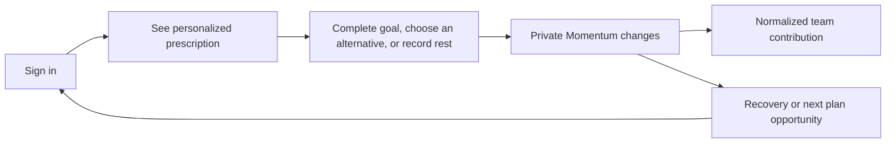

# ZoomiGo Momentum concept

Status: Revised design draft for product-owner review  
Prepared: 2026-08-19  
Feedback applied: Round 1  
Tightening pass applied: 2026-08-20

Implementation status: Review prototype only; no production rules or backend behavior changed  
Interactive review route: `/momentum`

## Recommendation in one sentence

Momentum should be a continuous, personalized picture of following an
appropriate plan: it makes today's goal obvious, treats stretch as optional,
recognizes recovery and rest, allows complete private logging, and turns only
normalized participation into safe team energy.

Momentum is not a points wallet, a permanent score, a losable streak, a workout
recommendation algorithm, or a measure of which child performs best.

## Product-owner feedback record

Round 1 established the following direction:

- Every planned exercise should have a goal and an optional stretch target in
  its own unit: distance, time, or repetitions.
- A hard prescription, including sprints or an assessment, should lead to a
  recovery, distance, or low-effort suggestion instead of more hard work.
- Workouts should not be one-size-fits-all. A consistent pattern may justify a
  gradual increase in future challenge.
- A later suggestion engine may choose a participant's next workout, but that
  system is adjacent to Momentum rather than part of its scoring model.
- Players may record additional workouts. The prescribed or chosen primary
  workout should matter most, one paired recovery may matter a little, and
  later extras should matter little or not at all to Momentum.
- A different approved workout may receive less Momentum than the prescription.
- Rest days should be deliberately recorded rather than inferred from an
  absence of activity.
- The plan should feel ongoing, not like it ends after a weekly checklist.
- Momentum needs a prominent, distinctive visualization.
- The design should demonstrate unranked Team highlights instead of only
  proposing the removal of Leaders.

The owner also raised personal rest photos or free text and possible team
sharing after administrator approval. That exploration is preserved, but it
conflicts with the current product rule that player-facing features use only
predefined input and contain no text fields, uploads, comments, or shared
user-created content. It is not included in this prototype.

Revisiting that restriction would require a separate decision and design for
guardian consent, visibility, storage, metadata removal, retention, moderation,
reviewer permissions, reporting, removal, and appeals. An email or alert alone
is not a sufficient youth-content moderation system.

## What this revision changes

The first Momentum draft used a weekly checklist, one rewarded entry per day,
and one extra active-day bonus. That model is superseded by this revision.

This draft instead uses:

- an ongoing stream of dated plan opportunities;
- one private goal and one optional private stretch target per exercise;
- bounded, weighted effects for the primary activity and paired recovery;
- structured rest as a real plan state;
- a non-terminal gauge with named states;
- normalized team participation and rotating highlights;
- mocked personalized suggestions separated from Momentum itself.

Calendar weeks may still be useful as a history or reporting filter. They are
not the player's primary mental model and do not reset Momentum.

## Tightening pass plan

The first interactive revision made nine concepts individually selectable. That
was useful as an inventory, but it made the feature feel like nine features and
asked the reviewer to assemble the product mentally. The next pass ranks every
idea by whether it strengthens one understandable personal-to-team loop.

### Ranked cuts and folds

1. **Cut the nine-scenario picker.** Replace it with one natural flow: see
   today's plan, check it in, receive closure or recovery, then see the Team
   effect.
2. **Choose Momentum Trail.** Remove Gauge Lab from the primary prototype. The
   chosen visual appears on both personal and Team surfaces so Momentum has one
   visual language.
3. **Fold consistency into `Why this plan`.** A small goal increase and its
   reason belong beside today's prescription, not on a separate suggestion
   engine screen.
4. **Fold hard-work recovery into completion.** Hill sprints are the default
   demanding prescription, so recovery should appear naturally after check-in
   instead of requiring a separate demonstration.
5. **Fold approved alternatives into the prescription.** One secondary action
   opens a compact inline choice without leaving the daily flow.
6. **Fold extra logging into private history.** Keep one quiet secondary
   disclosure after completion; do not give extra activity a feature-level
   destination.
7. **Keep only Training day and Rest day as review states.** Rest changes the
   dominant action and cannot be shown honestly as a footnote, but it should use
   the same Today shell and completion language.
8. **Collapse Team concepts into Team Momentum.** One shared pulse, one rotating
   unranked highlight group, and one privacy statement replace separate Team
   metrics, challenge, cheer, and highlights demos.
9. **Remove formula detail from player-facing review copy.** The design document
   may retain illustrative weights, but the UI should speak only in calm effects
   such as full, small, supportive, or history-only.

### Cohesion test

The pass is successful if a reviewer can understand the complete idea without
using a scenario menu:

> Follow today's appropriate plan, see personal Momentum move, recover when the
> work calls for it, and help the Team build Momentum without comparing results.

Anything that does not clarify that sentence should be removed, folded into a
secondary disclosure, or left in the design document for later work.

## Goals

Momentum should:

- make the next appropriate action obvious immediately after sign-in;
- give the player a clear and achievable definition of done;
- provide an optional path for additional challenge without making it required;
- let consistency influence future challenge within conservative limits;
- recommend recovery after demanding work or high private tiredness;
- make planned rest feel complete and intentional;
- preserve a complete private activity history without rewarding unsafe volume;
- create team belonging without public performance comparisons;
- explain what changed and why in plain, predefined language;
- work safely and clearly at 320 CSS pixels.

## Non-goals

Momentum should not:

- rank players by speed, distance, repetitions, assessments, effort, or
  tiredness;
- create a permanent number that a child can maximize indefinitely;
- require stretch work to maintain status;
- diagnose injury, exhaustion, readiness, or health;
- autonomously overrule a coach, parent, or guardian;
- turn extra sessions or exaggerated values into repeated reward;
- expose personalized goals or results on Team;
- require text, media, or an explanation to record rest;
- imply that missing one opportunity destroys prior progress.

## Core mental model

The player should understand four ideas:

1. **Here is the best next move we can suggest within the approved plan.**
2. **Reaching the goal means today's plan is complete.**
3. **Stretch is optional; recovery or rest may be the strongest next choice.**
4. **Following an appropriate plan adds safe energy to the team.**

The intended loop is:



The loop has no finish line. The app should still provide strong daily closure.

## Proposed plan model

### Plan opportunity

A dated plan opportunity should snapshot:

- participant and team context;
- approved activity identifier;
- private goal value and unit;
- optional private stretch value in the same unit;
- workload class: `moderate`, `hard`, `assessment`, `recovery`, or `rest`;
- whether an approved alternative is equivalent or partial;
- optional paired recovery activity;
- predefined reason codes for the suggestion;
- recommendation or coach-plan version;
- active date window and local calendar context.

Snapshotting prevents a later plan change from rewriting what a historical
entry meant.

An assessment remains a private, coach-owned event unless a later product
decision explicitly makes it player-recordable. Its workload class may still
cause a recovery suggestion.

### Goal and stretch

- The goal is the complete and successful prescription.
- Stretch is an optional target in the same unit.
- Stretch is never required to hold Momentum or contribute to Team.
- The UI must show the goal with greater visual and semantic certainty than the
  stretch target.
- The app should not promote stretch when a recovery rule is active.
- One prescription can produce at most one stretch effect.

Player-facing copy should use the rule: **Goal means complete. Stretch is
optional.**

### Alternatives

The design distinguishes two approved alternatives:

1. A normal different activity receives partial Momentum because it is less
   aligned with the current prescription.
2. An activity marked as a safety-equivalent substitution receives the same
   effect as the prescription.

The effect must be explained before the player confirms the alternative. The
wording should preserve agency and must not frame a safe choice as disobedience.

Weather, facility access, pain, recovery signals, and a coach substitution are
candidate reasons for equivalence. The authoritative rules remain open.

## Draft contribution model

The review prototype uses internal weights to compare behavior. These values
are illustrative, private, and not approved production formulas.

| Event                          | Private gauge | Normalized Team | Result required   | Visibility           |
| ------------------------------ | ------------- | --------------- | ----------------- | -------------------- |
| Prescribed goal                | Full `+12`    | `1`             | Yes               | Normalized only      |
| Prescribed stretch             | Small `+2`    | `0`             | Yes               | Private              |
| Approved different activity    | Partial `+7`  | `0.5`           | Yes               | Normalized only      |
| Equivalent safety substitution | Full `+12`    | `1`             | Yes               | Normalized only      |
| Paired recovery                | Support `+3`  | `0`             | Yes               | Private              |
| Planned rest                   | Hold `+0`     | `1`             | No                | Aggregate Team only  |
| Additional accepted activity   | None `+0`     | `0`             | Activity-specific | Private history only |

The proposed ceiling is one primary plan effect, one optional stretch effect,
and one paired recovery effect per prescription. Later entries remain valid
history but do not create another Momentum or Team effect.

The planned-rest Team value is a prototype proposal, not a settled rule. It
represents following the team plan, not athletic output, and must never identify
who rested.

## Continuous Momentum gauge

### Meaning

The gauge summarizes recent plan-following, not lifetime achievement. It should
answer, “How steady is my current training rhythm?” without suggesting a perfect
score.

The prototype uses four player-facing bands:

- `Warming up`
- `Building`
- `Rolling`
- `Strong`

The internal demo clamps the gauge below a perfect endpoint and never presents
`100%`. Exact thresholds, rolling window, cooling behavior, and missed-plan
behavior remain open.

Every visual treatment must include:

- the named text state;
- a short explanation of what recently changed;
- meaning that does not rely on color;
- a reduced-motion treatment;
- no lifetime total or public numeric value.

### Chosen visual direction

The tightened prototype uses **Momentum Trail** on personal and Team surfaces.
It shows recent movement along a path with visible room ahead and does not look
finishable. Flow Bar and Orbit Gauge are cut from the review UI; comparing
visual systems was distracting from evaluating the Momentum experience itself.

Momentum Trail is still a hypothesis. Usability testing must confirm that it
reads as an ongoing rhythm rather than a score to fill.

## Personalization and consistency

Momentum consumes a prescription; it does not create one. A future suggestion
engine should be a separate service or domain boundary.

Candidate private inputs are:

- coach-approved plan and activity constraints;
- recent completion of prescribed goals;
- recent consistency;
- private tiredness and workload;
- known practices and matches;
- recovery after demanding work;
- age-appropriate progression and deload limits;
- combined load across multiple team memberships.

The output should be one structured prescription containing a goal, optional
stretch, workload class, possible paired recovery, and predefined reason codes.

Before production, the engine must be:

- advisory and overrideable by an authorized adult;
- bounded by coach-approved templates and workload ceilings;
- able to maintain or lower challenge, not only increase it;
- conservative when data is missing or conflicting;
- explainable through predefined player-facing reasons;
- forbidden from using public placement, cheers, popularity, or teammate data;
- reviewed by an appropriate youth-training expert.

The prototype demonstrates two mocked outputs:

- a small increase after a steady pattern;
- a recovery recommendation when private tiredness is high.

No prediction or recommendation algorithm is implemented.

## Recovery and over-exertion safeguards

The safest applicable signal wins. In descending priority:

1. adult safety restriction or explicit recovery plan;
2. known hard or assessment workload;
3. high private tiredness;
4. ordinary personalized progression;
5. optional stretch.

After a hard or assessment prescription, the promoted next action should be a
predefined recovery, distance, or low-effort option. The interface should say
`Main work complete`, offer at most one paired recovery, then show an honest
stopping point.

High tiredness must remain private. It may suppress stretch, lower the next
goal, or suggest recovery, but it must not reduce Team status, notify teammates,
or diagnose a condition.

## Rest as a plan state

Planned rest should:

- appear as today's prescription rather than a blank Home state;
- be recorded with one tap and no result value;
- complete the plan without suggesting more training;
- appear in private history;
- optionally offer only predefined, private reflection choices;
- keep any reason or recovery signal off Team.

The review prototype deliberately contains no text field, photo control, file
control, or sharing action.

## Extra logging and anti-gaming

Every valid approved activity may remain in private history. Momentum does not
need to reward every entry for the history to be useful.

Controls proposed for implementation are:

- structured activity types and unit-specific ranges;
- authoritative timestamps and team-local plan windows;
- idempotent saves and duplicate detection;
- one primary, one stretch, and one paired-recovery effect per prescription;
- no reward for entering a larger raw result beyond the stretch threshold;
- no repeated Team contribution from extra activity;
- calm copy that explains when an entry is history-only;
- coach audit tools that do not create public suspicion or shame.

This design reduces the payoff for fake volume. It does not claim to prove that
a child completed an activity.

## Team Momentum and highlights

Personalized plans cannot be compared through raw targets. Team receives only a
normalized indication that a plan opportunity was followed.

The proposed Team surface replaces the Leaders destination with:

- `Team plan pulse`: an aggregate picture of recent plan-following;
- `Steady strides`: rotating recognition for several recent plan opportunities;
- `Team challenge complete`: completion without results;
- `Encouragement shared`: predefined cheer activity without popularity totals.

Eligibility should be inclusive and rotating rather than restricted to a top
three. The same player should not occupy every highlight simply because their
personal prescription contains more volume.

Team must never display:

- goal or stretch targets;
- distance, time, repetitions, speed, or assessment results;
- effort, tiredness, recovery reasons, or rest reasons;
- a public Momentum number;
- ordered player placement.

Planned rest may contribute to the aggregate pulse only if the product owner
approves that rule. The surface must not reveal which player rested.

## Independent sign-in and daily return

The authenticated Home screen should be useful before a coach or parent says
anything that day.

The proposed priority is:

1. prominent Momentum state and short explanation;
2. today's prescription, goal, and optional stretch;
3. one dominant check-in action;
4. an approved-alternative path;
5. a small, privacy-safe Team preview.

After the primary activity, the screen should show completion, any permitted
paired recovery, and then closure. Additional logging remains available from
history or a secondary action but is not promoted as the next way to gain
Momentum.

The design should motivate return through clarity, growth, team belonging, and
curiosity about the next appropriate plan—not through expiration warnings,
countdowns, or streak-loss threats.

## Information architecture consolidation

| Current surface                        | Proposed destination                                |
| -------------------------------------- | --------------------------------------------------- |
| Home assignment hero                   | Today's prescription inside the Momentum experience |
| Weekly goal and streak cards           | Continuous gauge plus recent-plan explanation       |
| Lifetime effort points                 | Retire; keep private reflection without currency    |
| Challenge and Team-goal duplication    | One Team plan pulse plus a challenge highlight      |
| Leaders destination                    | Team highlights                                     |
| Generic record form                    | Plan-specific check-in with goal and stretch        |
| Recovery guidance after tiredness only | Workload-aware recovery state                       |
| Unrecorded planned rest                | Structured rest check-in                            |

The production activity history remains valuable and should not be deleted.
This proposal changes which surfaces compete for attention, not whether past
training can be reviewed.

## Player-facing states

| State                | Dominant message                                   | Primary action                     |
| -------------------- | -------------------------------------------------- | ---------------------------------- |
| Suggested            | Today's goal is ready                              | Start or complete the prescription |
| Goal complete        | Today's plan is complete                           | Review recovery if applicable      |
| Stretch complete     | Optional challenge recorded                        | Finish                             |
| Alternative selected | Approved different work still counts               | Complete chosen activity           |
| Recovery suggested   | Main work is complete; only low effort is promoted | Log recovery or finish             |
| Rest prescribed      | Rest is today's plan                               | Record rest                        |
| Rest recorded        | Plan complete; nothing else suggested              | Finish                             |
| Extra recorded       | Saved to history; no Momentum change               | Return to history or Home          |

## Privacy and visibility

| Information                  | Player | Authorized coach | Team aggregate | Team player card |
| ---------------------------- | ------ | ---------------- | -------------- | ---------------- |
| Goal and stretch target      | Yes    | Yes              | No             | No               |
| Raw result                   | Yes    | Yes              | No             | No               |
| Effort and tiredness         | Yes    | Policy decision  | No             | No               |
| Rest reflection              | Yes    | Policy decision  | No             | No               |
| Personal Momentum band       | Yes    | Policy decision  | No             | No               |
| Normalized plan contribution | Yes    | Yes              | Aggregate only | Eligibility only |
| Assessment result            | No     | Yes              | No             | No               |

## Important edge cases

| Situation                                 | Draft behavior                                                             |
| ----------------------------------------- | -------------------------------------------------------------------------- |
| Result reaches goal and stretch           | Apply goal once and one small private stretch effect                       |
| Player logs the same activity repeatedly  | Keep valid history; no repeated plan effect                                |
| Player chooses a normal approved activity | Show partial effect before confirmation                                    |
| Player needs a safety substitution        | Use full effect only when an authorized rule marks it equivalent           |
| Hard work is completed                    | Suppress more hard work and offer at most one paired recovery              |
| High tiredness is reported                | Keep it private; suppress growth and prefer recovery                       |
| Planned rest is recorded                  | Require no result; hold private gauge in the prototype                     |
| A plan is edited later                    | Historical entry retains its plan snapshot and recommendation version      |
| A player belongs to multiple teams        | Future suggestion logic considers combined known workload                  |
| An opportunity is missed                  | Do not use loss language; exact gauge cooling remains open                 |
| An entry is backdated                     | Recalculate only inside an authoritative plan window; notification is open |
| Connected save is offline or pending      | Do not claim Momentum changed until the authoritative save succeeds        |
| An assessment affects the next plan       | Use private coach-owned workload information, never a public result        |
| Team has few recent events                | Show a neutral pulse state, not an empty podium or named non-participants  |

## Gap and consistency audit after revision

### Inconsistencies closed in this pass

- Removed the finite weekly completion model from the current design baseline.
- Replaced the one-entry-only rule with bounded primary, stretch, and recovery
  effects.
- Reconciled lower alternative credit with full safety-equivalent substitution.
- Added concrete structured rest behavior while preserving the no-user-content
  safety baseline.
- Separated future workout suggestion from Momentum calculation.
- Replaced identical-plan Team math with normalized participation.
- Added a complete Team-highlights prototype.
- Added plan versioning, multi-team load, assessment ownership, gauge cooling,
  and accessibility to the decision record.

### Decisions still open

1. Does Momentum Trail communicate rhythm without inviting maximization?
2. What rolling window or cooling behavior produces calm continuity?
3. Who may set goal, stretch, workload, equivalence, and recovery values?
4. What evidence and ceiling permit consistency-driven growth?
5. Should a normal approved alternative contribute `0.5` to Team or only
   private Momentum?
6. Should planned rest contribute one normalized Team unit?
7. Is paired recovery same-day, next-opportunity, or context-dependent?
8. Which private inputs may a future suggestion engine consume?
9. What level of coach approval is required for generated prescriptions?
10. May an assessment ever be player-recorded?
11. How should missed opportunities and backdated entries affect the gauge?
12. Is structured private rest reflection sufficient for the first release?

### Risks to validate

- A partially rewarded alternative may still feel like punishment.
- Any growing visual may invite maximization even without a visible number.
- A Team contribution for rest may be confusing without careful language.
- Personalized goals may appear arbitrary unless the reason is understandable.
- A prominent gauge could overshadow the safer next action.
- Small internal weights can become de facto points if exposed through copy,
  animation, analytics, or API responses.

## Review prototype

The `/momentum` route contains two tabs.

### Design brief

The shorter summary explains one loop, distinguishes Personal and Team
Momentum, shows what was folded into the loop, and keeps only the core safety
rules and four review questions.

### Player flow

The prototype now demonstrates one connected path:

1. See today's personal Momentum and prescription.
2. Understand the goal, optional stretch, and consistency-based reason.
3. Check in the prescription or choose an approved alternative inline.
4. Receive recovery guidance and daily closure after demanding work.
5. See the one normalized contribution inside Team Momentum.

Training day and Rest day are the only review-state switch. Rest reuses the same
Today hierarchy, records with one tap, and leads to the same Team destination.
Extra activity is available only as a secondary private-history disclosure
after completion.

The mock is intentionally code-native, mobile-first, and disconnected from
production data. It contains no recommendation algorithm, persistence, upload,
or production Momentum API.

## Suggested implementation slices if approved

### Slice 1: Plan opportunity domain

- Define versioned plan opportunities, goal and stretch targets, workload, and
  alternative equivalence.
- Add authorization and visibility tests before changing player surfaces.

### Slice 2: Personal Momentum projection

- Derive bounded personal effects from authoritative entries.
- Add idempotency, duplicate, plan-window, local-calendar, and backfill tests.
- Replace Home's competing progress cards only after projection behavior is
  stable.

### Slice 3: Recovery and rest

- Add prescribed recovery and structured rest plan kinds.
- Test that recovery signals suppress hard and stretch prompts.
- Keep private signals out of Team APIs.

### Slice 4: Team projection and highlights

- Project only normalized participation.
- Add rotating eligibility and sparse-team behavior.
- Remove Leaders from primary navigation only after the Team replacement is
  complete.

### Slice 5: Suggestion-engine discovery

- Run a separate product, safety, coaching, and data-design effort.
- Do not infer the engine from Momentum weights.

## Tests required before production implementation is complete

- A prescribed goal produces one primary effect.
- A stretch produces at most one small private effect and no Team effect.
- An ordinary alternative and an equivalent substitution are distinguishable.
- A paired recovery produces at most one supportive private effect.
- Additional entries remain valid history without repeated effects.
- Planned rest requires no result and does not reveal who rested.
- Hard work, assessment workload, and high tiredness suppress more hard work.
- Private targets, results, tiredness, recovery, and assessment data never
  appear in Team responses or views.
- A plan change does not rewrite historical association.
- Multi-team known load can prevent a challenge increase.
- Backdated and team-local calendar boundaries are deterministic.
- Pending or failed saves do not claim a Momentum change.
- The gauge has a text state and remains usable without color or motion.
- All player flows work at 320 CSS pixels and with keyboard navigation.
- No player-facing rest flow contains open text or upload controls.

## Product-owner review prompts

The most useful next feedback is:

1. Does Momentum Trail feel motivating without looking like a score to fill?
2. Does `goal means complete; stretch is optional` feel clear in the demo?
3. Does partial Momentum for a different approved activity preserve enough
   player agency?
4. Should planned rest support the aggregate Team pulse?
5. Does the recovery screen create enough closure after demanding work?
6. Are Team highlights satisfying without ordered placement or raw results?
7. Is the mocked consistency-growth explanation credible enough to justify a
   separate suggestion-engine design?
8. Is structured, private rest tracking enough for the first release?

## Prototype file map

```text
docs/MOMENTUM_CONCEPT.md              Revised concept, feedback, audit, and rollout
docs/OPEN_DECISIONS.md                Unapproved Momentum decisions and assumptions
app/momentum/content.ts               Central review and demo copy
app/momentum/model.ts                 Pure illustrative contribution rules
app/momentum/model.test.ts            Contribution and recovery rule tests
app/momentum/MomentumConcept.tsx      Design brief and connected player flow
app/momentum/MomentumConcept.test.tsx Interaction and visibility tests
app/momentum/momentum.css             Responsive code-native mock visuals
```

## Revision history

- 2026-08-19, initial draft: finite weekly plan, one daily contribution, and a
  capped extra active day.
- 2026-08-19, feedback record and audit: captured continuous plan, goal/stretch,
  recovery pairing, consistency growth, structured rest, Team highlights, and
  the user-content safety conflict.
- 2026-08-19, revision 2: replaced the obsolete baseline, aligned the written
  rules with the scenario prototype, and recorded remaining gaps and risks.
- 2026-08-20, tightening pass: cut the nine-scenario inventory, chose Momentum
  Trail, folded alternatives, consistency, recovery, and extra logging into one
  daily path, and kept planned rest as the only alternate review state.
