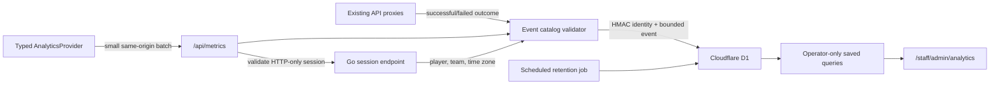

# User metrics plan

Status: first implementation slice prepared for review; production collection
remains disabled pending the decisions at the end of this document.

The first slice includes the typed catalog, first-party ingestion, HMAC
identities, 90-day bounded raw storage, route/active-time summaries,
authoritative product outcomes, the operator dashboard, a capacity card, and
disabled-by-default deployment wiring. Cohort materialization, subject
erasure/tombstones, and deterministic sampling remain follow-up scale work
before production exceeds the initial free-tier envelope.

This plan adds first-party product analytics without sending children's behavior
to a general-purpose analytics vendor. It is deliberately separate from player
progress, leaderboards, audit logs, and operational monitoring.

## Recommendation

Use a small, provider-neutral analytics layer in the PWA and store validated
events in a dedicated Cloudflare D1 database. Add an operator-only dashboard for
the standard product scorecard, funnels, retention, route engagement, time-of-day
usage, feature adoption, and privacy-limited user drilldowns.

Cloudflare D1 is the recommended first sink because it:

- uses infrastructure already present in this deployment;
- has no analytics SDK in the player bundle and no new analytics vendor account;
- supports indexed SQL, explicit retention, subject erasure, and durable cohorts;
- scales to zero and should remain inside the included allowance at the expected
  youth-team volume; and
- lets the application own the event contract instead of inheriting a vendor's
  autocapture model.

Do not use browser autocapture, session replay, heatmaps, advertising identifiers,
or third-party cookies. If a hosted product-analytics UI becomes worth the extra
privacy review later, the storage adapter can forward the same canonical events
to PostHog or Mixpanel without changing feature code.

## Provider choice

| Option                              | Advantages                                                                                                            | Problems for this product                                                                                                                    | Decision                                              |
| ----------------------------------- | --------------------------------------------------------------------------------------------------------------------- | -------------------------------------------------------------------------------------------------------------------------------------------- | ----------------------------------------------------- |
| Cloudflare D1                       | First-party endpoint, SQL, explicit deletion and retention, 5 GB included storage, and generous included reads/writes | We must build a focused dashboard and retention job                                                                                          | **Use for v1**                                        |
| Cloudflare Workers Analytics Engine | Very cheap non-blocking writes and excellent aggregate time-series queries                                            | Raw data is retained for only three months; its query surface is designed for aggregates and is a poor owner of erasable per-player journeys | Keep for future anonymous operational aggregates only |
| PostHog Cloud                       | Excellent funnels, retention, paths, and a 1 million event/month free tier                                            | Adds a third-party processor and tempting high-risk features such as replay and broad autocapture                                            | Reconsider only after privacy approval                |
| Mixpanel                            | Mature product reports and 1 million events on the free plan                                                          | Free plan limits saved reports and lacks some governance features; it is another processor of child-linked behavior                          | Do not use for v1                                     |
| Existing DigitalOcean SQLite        | No new bill and identity is already authoritative there                                                               | Analytics queries and writes would compete with the production API on a 512 MiB single VM                                                    | Use only as a fallback if D1 cannot be approved       |

The pricing claims above are current as of 2026-08-11 and must be rechecked before
provisioning. Cloudflare currently includes 5 GB of D1 storage and, depending on
the Workers plan, at least 100,000 written rows and 5 million read rows per day.
Indexes also count as writes, so the design uses only the three query-critical
indexes.

## Product questions this should answer

### Executive scorecard

The primary success metric is **weekly meaningful active players**: distinct
players who successfully record at least one approved training entry in a
calendar week. It measures the product's purpose without rewarding workout
volume or athletic performance.

The scorecard should also show:

- daily, weekly, and rolling-30-day active players;
- DAU/WAU and WAU/MAU stickiness;
- new player activation: first successful sign-in to first saved entry within
  one and seven days;
- D1, D7, D14, and D30 return retention by first-use cohort;
- visits per active player, active minutes per player, and median visit length;
- training-entry funnel conversion and median time to save;
- weekly goal and assignment completion rates from safe server outcomes;
- adoption of Team, Leaders, reactions, session history, and avatar builder;
- successful actions divided by rejected/failed actions; and
- standalone-PWA versus browser usage.

Every card must show its exact definition, window, sample size, and comparison
period. Counts below five players should be suppressed in team/cohort breakdowns.

### Where and when users spend time

- Active time and views by canonical route: Home, Log, Team, Leaders, Me,
  Session Detail, Avatar Builder, and Sign In.
- Median active seconds per view, total active minutes, and exits by route.
- Common route paths within a visit, using canonical route names only.
- Team-local weekday/hour heatmap, derived from the team's configured time zone.
- Visit frequency and days since last meaningful action.
- Device mode (`standalone` or `browser`) and coarse viewport (`small`, `medium`,
  or `large`), without user-agent strings or device fingerprints.

"Time spent" means visible, non-idle time. The client pauses its counter when the
document is hidden and after 60 seconds without keyboard, pointer, or touch input.
It flushes at route change, hidden state, every 60 active seconds, and best-effort
page exit. Duration chunks are capped, so a sleeping tab cannot become a
multi-hour visit.

### PWA-specific insights

- Home/FAB/navigation source to Log and the completion rate for each source.
- Default assigned activity retained versus another approved activity selected.
- Save success, safe validation failure reason, and abandonment on Log.
- Same-day versus 1–7-day backdated entries, without the entered timestamp.
- Assignment-linked entry and assignment-completion rates, without result values.
- Entry deletion rate and coarse age bucket within the allowed 24-hour window.
- Team-board adoption and reaction-send conversion by approved context.
- Leaderboard period/metric selection, never rank, score, or player performance.
- Avatar-builder open-to-save conversion and save success, never chosen parts.
- Session-history and cheer-inbox adoption.
- Standalone PWA share and online/offline transitions during an active visit.

## Canonical event system

All analytics calls use one API:

```ts
analytics.track("training_entry_started", {
  source: "home_assignment",
  defaulted_activity: true,
});
```

`track` accepts only names and properties declared in `app/analytics/catalog.ts`.
The catalog is both a TypeScript type source and a runtime allowlist. Each entry
declares:

- event name and schema version;
- product question/purpose;
- actor scope: `subject`, `aggregate_only`, or `staff`;
- source: `automatic_client`, `explicit_client`, or `server_outcome`;
- allowed enum/boolean/bounded-number properties;
- raw and aggregate retention class; and
- whether the event may appear in a user drilldown.

Adding an ad hoc metric therefore means adding one reviewed catalog entry, its
test, and one `analytics.track` call. Unknown names, unknown properties, strings
outside approved enums, oversized batches, and forbidden keys are rejected at
both compile time and the server boundary. A generic `Record<string, unknown>`
escape hatch is intentionally absent.

### Automatic events

| Event                  | Source                        | Safe properties                                      |
| ---------------------- | ----------------------------- | ---------------------------------------------------- |
| `app_visit_started`    | Analytics provider            | display mode, viewport bucket, online state          |
| `route_viewed`         | Analytics provider            | canonical route, prior canonical route, entry source |
| `route_engaged`        | Analytics provider            | canonical route, bounded active milliseconds         |
| `connectivity_changed` | Analytics provider            | online/offline                                       |
| `app_installed`        | Browser event where supported | no properties                                        |

The provider lives once inside the authenticated player shell, so every current
and future player route gets visit, route, and active-time coverage for free.
Dynamic IDs, query parameters, URL fragments, and document titles never enter
the event stream.

### Explicit and server-authoritative events

| Area           | Events                                                                                                                           |
| -------------- | -------------------------------------------------------------------------------------------------------------------------------- |
| Authentication | `player_sign_in_succeeded`, aggregate-only `player_sign_in_failed`, `player_signed_out`                                          |
| Today/training | client intent events; server-owned training entry outcomes and bounded `today_requirement_recorded` source/kind/outcome          |
| Prize Boxes    | server-owned `prize_box_operation`; `reward_destination_opened` with destination and item kind only                              |
| Team/social    | reaction events, leaderboard/challenge intent, and aggregate-only `team_reward_reported` outcome                                 |
| Staff planning | anonymous aggregate `staff_plan_operation` and `staff_reward_operation`; never a staff, team, plan, reward, or report identifier |
| Profile        | `avatar_builder_opened`, server-owned `avatar_saved`, `session_history_opened`, `cheer_inbox_opened`                             |
| Reliability    | server-owned `product_operation_completed` with operation, outcome, and latency bucket                                           |

Business outcomes are recorded only after the same-origin proxy receives the
authoritative backend response. Client clicks describe intent; they never claim
that a save, delete, reaction, or avatar update succeeded.

## Identity and privacy boundary

The browser supplies only event intent, a random per-tab visit ID held in
`sessionStorage`, the event time, and allowlisted properties. It never supplies
an account, player, team, role, or analytics subject key.

The metrics route validates the existing HTTP-only player session with the Go
API. At the Worker it derives:

- `subject_key = HMAC(analytics_secret, player_id)`;
- `team_key = HMAC(analytics_secret, team_id)`; and
- local weekday/hour from the authoritative team time zone.

The HMAC secret is a Worker secret, is not exposed to the browser, and is not
stored in Git. Names, initials, emails, raw player/account/team IDs, credential
material, and session tokens are never written to D1. The operator dashboard
shows pseudonymous subjects by default. An operator may deliberately select a
player through the existing protected player search; the server hashes that
selected ID and shows only that player's analytics. D1 never becomes a second
roster.

### Never collect

- sprint times, pace, duration, distance, repetitions, assessment values, effort,
  exhaustion, or inferred health/overtraining state;
- player names, initials, staff emails, avatar choices, PINs, QR values, cookies,
  session tokens, idempotency keys, request/entry IDs, or free-form text;
- full URLs, query strings, fragments, referrers, IP addresses, precise location,
  user-agent strings, advertising identifiers, or fingerprints;
- DOM contents, screenshots, recordings, heatmaps, keystrokes, or pointer trails;
  or
- exception messages, response bodies, or stack traces in product analytics.

Operational logs and security audit records remain separate systems with their
own purposes and access rules.

## Request and storage architecture



Analytics is fail-open for the product: timeouts, disabled configuration, quota
limits, or D1 errors must never block sign-in, navigation, training entry,
reactions, or sign-out. The endpoint accepts at most 20 events/16 KiB per batch,
allows only a short clock skew, deduplicates event IDs, and enforces a conservative
per-subject daily ingestion ceiling.

### D1 tables

`analytics_events` holds 90 days of validated raw events:

- opaque event ID, schema version, source, event name;
- server-received and bounded client-occurred timestamps;
- optional pseudonymous subject/team keys and per-tab visit ID;
- canonical route;
- bounded active duration where applicable; and
- validated property JSON.

Indexes are limited to `(event_name, occurred_at)`, `(subject_key, occurred_at)`,
and `(occurred_at)`.

`analytics_daily_metrics` holds non-personal daily aggregates for 13 months.
`analytics_maintenance` makes rollups and retention idempotent.
`analytics_erasure_tombstones` ensures a Time Travel restore cannot silently
reintroduce a recently erased subject; the cleanup job reapplies tombstones and
ages them out after raw-event retention plus the backup window.

Raw events older than 90 days are deleted daily after aggregate rollup. A player
erasure deletes matching raw events immediately and records a tombstone. Aggregate
counts are not decremented because they cannot identify a player, but this policy
still requires product-owner/privacy approval.

## Dashboard v1

Analytics is not a new console. Add an **Analytics** destination to the existing
platform-operator dashboard navigation and render `/staff/admin/analytics` inside
its current layout, cards, responsive shell, search patterns, Cloudflare Access
gate, and application role check. Coaches do not receive behavioral analytics
about children.

The first dashboard has five tabs:

1. **Overview** — weekly meaningful actives, DAU/WAU/MAU, activation, retention,
   active time, successful entries, and reliability.
2. **Journey** — sign-in-to-first-entry and Log funnels, median completion time,
   abandonment, and common canonical paths.
3. **Features** — route/feature adoption, leaderboard filters, reactions, avatar,
   history, and standalone PWA share.
4. **When** — team-local weekday/hour heatmap and visit-frequency distribution.
5. **Player lookup** — deliberate single-player search and pseudonymous journey;
   no bulk named table and no raw athletic data.

Filters: 7/30/90 days, team (minimum cohort five), display mode, and new/returning.
Queries are predefined, parameterized, sampling-aware if a future sink requires
it, and kept in source control. V1 does not expose arbitrary SQL in the app.

## Proposed implementation sequence

Follow red-green-refactor within each step. Each step should be independently
reviewable and leave analytics disabled when its backing resource is absent.

1. **Contract and privacy tests.** Add the event catalog, typed `track` API, route
   canonicalizer, forbidden-field checks, bounded payload validation, and a null
   sink. No network writes yet.
2. **D1 repository.** Add local migrations, prepared queries, deduplication,
   retention/rollup/erasure operations, and repository contract tests against a
   real local D1 database.
3. **Authenticated ingestion.** Add the same-origin batch route, session-derived
   HMAC identity, team-time-zone enrichment, limits, and black-box route tests.
4. **Crosscutting client basics.** Mount `AnalyticsProvider` in the authenticated
   shell and test route changes, visibility, idle behavior, duration caps,
   batching, failed delivery, and PWA display mode.
5. **Authoritative outcomes and ad hoc events.** Instrument the auth and ZoomiGo
   proxy seams plus the small number of intent/filter interactions listed above.
6. **Operator dashboard.** Extend the existing admin navigation and shell with
   predefined query functions, privacy thresholds, loading/empty/error states,
   operator guards, central copy, and responsive analytics views.
7. **Operations.** Add the scheduled rollup/retention handler, D1 resource/binding
   configuration, secret/feature-flag runbook, cost checks, and recovery-erasure
   instructions.
8. **Verification.** Run targeted unit/integration/browser tests, formatting,
   linting, type checks, static contracts, and production build. Add Docker E2E
   coverage for the authenticated ingestion and operator authorization workflows,
   but reserve the full suite for a release-candidate pass.

## Implemented file tree

```text
drizzle/
  0001_product_analytics.sql
lib/
  analytics/
    AnalyticsProvider.tsx
    catalog.ts
    catalog.test.ts
    client.ts
    client.test.ts
    identity.ts
    proxy-events.ts
    proxy-events.test.ts
    route.ts
    route.test.ts
    server.ts
    server.test.ts
    storage.ts
    storage.test.ts
app/
  api/
    metrics/
      route.ts
    auth/session/route.ts                 # authoritative auth outcomes
    zoomigo/[...path]/route.ts            # authoritative product outcomes
  components/AppShell.tsx                 # one provider mount
  content/routes.ts                       # analytics route constant
  staff/admin/
    AdminNav.tsx                          # extend the existing console
    analytics/
      page.tsx
    guards.test.ts
backend/
  internal/authn/
    service.go                            # project team time zone into sessions
deploy/
  release/
    configure-worker.mjs
    configure-worker.test.mjs
docs/
  USER_METRICS_PLAN.md
```

## Deployment and cost guardrails

- Create one dedicated D1 database with a reserved name; keep its generated ID
  only in the protected production environment, never in tracked prose.
- Add `PRODUCT_ANALYTICS_ENABLED=false` by default. Production collection starts
  only after the decisions below are approved and the D1 binding/secret exist.
- Keep the HMAC key in a Worker secret and document rotation. Rotating it breaks
  longitudinal identity unless a controlled migration is performed.
- Use local D1 for all default tests. No default test contacts Cloudflare or needs
  credentials.
- Check D1 row/storage metrics weekly once usage exceeds 50% of any free limit.
  Alert at 50%, 70%, and 85%; do not discover the limit through dropped writes.
- Give analytics an explicit budget: at most 10 stored event records and two
  analytics HTTP flushes per normal active player-day before sampling.
- Disable collection rather than degrade the player experience if quota or cost
  guardrails are reached.

## Free-tier scale projection

Capacity is governed by the busiest UTC day, not registered users or monthly
active users. Soccer challenges may synchronize usage onto one day, so planning
uses **peak DAU** and keeps 15–20% headroom.

Current Cloudflare Free limits checked on 2026-08-11:

- Workers: 100,000 Worker-script requests/day and 10 ms CPU/request. Static Asset
  requests are free and unlimited when they bypass the Worker script.
- D1: 100,000 rows written/day, 5 million rows read/day, 500 MB per database,
  5 GB total account storage, and 7-day Time Travel.
- A secondary index adds a billed row write when its indexed columns are written.
  The three planned raw-event indexes therefore make one event approximately four
  billed writes before roughly 10% maintenance/rollup overhead.

These are projections, not promises. The implementation must measure actual
Worker invocations per active player, D1 `rows_written`, `rows_read`, and database
growth for at least two representative weeks, then replace the assumptions below
with observed coefficients.

### D1 write and storage ceilings

The model uses:

```text
initial write ceiling DAU = 100,000 / (events per active day × 4 writes × 1.10 overhead)
steady write ceiling DAU = 100,000 / (events per active day × 8 writes × 1.10 overhead)
storage ceiling DAU = 500 MiB / (events per active day × retention days × bytes per event)
```

Storage estimates assume 650–750 bytes per validated event including index
overhead. After the retention window fills, expiring a row also removes its
three index entries, so steady-state write capacity is about half the initial
write-only ceiling. Daily aggregates are small, and the practical planning
ceiling keeps a 15–20% reserve.

| Collection mode               | Events/player-day | Raw retention | Initial write ceiling | Steady write ceiling | Storage ceiling | Practical peak DAU | Approximate MAU at 25% peak DAU/MAU |
| ----------------------------- | ----------------: | ------------: | --------------------: | -------------------: | --------------: | -----------------: | ----------------------------------: |
| Naive page/action stream      |                30 |       90 days |                  ~750 |                 ~375 |            ~250 |           **~250** |                              ~1,000 |
| Recommended initial summaries |                10 |       90 days |                ~2,250 |               ~1,100 |            ~800 |       **~700–800** |                        ~2,800–3,200 |
| Scale mode                    |                10 |       30 days |                ~2,250 |               ~1,100 |          ~2,400 |     **~900–1,100** |                        ~3,600–4,400 |
| Lean, sampled navigation/time |                 6 |       30 days |                ~3,750 |               ~1,900 |          ~4,000 |   **~1,500–1,800** |                        ~6,000–7,200 |

The 13-month anonymous daily aggregates remain in every mode. Shortening raw
retention reduces the window for individual journey debugging, not the executive
scorecard, D30 retention, funnels, or long-term trends; those are materialized
before raw rows expire.

D1 reads should not be the first limit. The initial dashboard bounds scans to 30
days and caches each overview for five minutes inside a Worker isolate. Before
the capacity card reaches 70%, incremental rollups must replace those raw-table
queries; repeatedly scanning a mature raw table would otherwise consume the
5-million-row allowance in only a few dashboard refreshes.

### Workers request ceiling

Static JS, CSS, images, and other matching assets are free and unlimited when
served directly by Workers Static Assets. Dynamic page/SSR, auth, API, and
analytics requests count against the account's 100,000/day Worker limit.

| Dynamic Worker requests per active player-day | Peak DAU at the hard limit | Planning ceiling with 20% reserve |
| --------------------------------------------: | -------------------------: | --------------------------------: |
|              20 (efficient, mostly one visit) |                      5,000 |                            ~4,000 |
|                         30 (working estimate) |                      3,333 |                            ~2,650 |
|                 60 (heavy navigation/retries) |                      1,667 |                            ~1,300 |

Analytics should add only one or two requests per normal player-day. Server-owned
outcome events piggyback on the existing API proxy invocation, and client events
flush as one batch at hidden/exit plus at most one bounded mid-visit flush. Batch
size reduces Worker requests but does **not** reduce D1 row writes.

The 10 ms Workers Free CPU limit is per invocation, not a user-count quota. Auth
and SSR workloads can use 10–20 ms, so p95 CPU must be measured in Cloudflare.
Precomputed dashboard aggregates, prepared D1 queries, small payloads, and no
large JSON transformations keep the analytics path below the limit. A consistent
CPU overage requires optimization or Workers Paid regardless of DAU.

### How to stay free longer without losing the useful metrics

Apply these in order:

1. **Summarize a visit, not every gesture.** Store one route summary per distinct
   route/visit with total active time. Collapse repeated visits to the same route
   and do not store heartbeats.
2. **Keep business outcomes at 100%.** Never sample successful entry creation,
   deletion, reaction, avatar save, sign-in success, or approved failure codes.
   These power activation, retention, funnels, and reliability.
3. **Sample only high-volume experience events.** At 70% of the projected budget,
   deterministically retain 50%, then 25%, of route/navigation/time summaries by
   HMAC subject and day. Store the sample weight so aggregate queries remain
   correct; omit sampled events from individual journeys rather than pretending
   they are complete.
4. **Pre-aggregate once.** Incrementally materialize daily/cohort/funnel facts and
   have the admin dashboard query those rows. Never recompute a 90-day dashboard
   from raw events on each view.
5. **Use adjustable raw retention.** Start at 90 days; prepare reviewed 60-day and
   30-day modes. Step down before the database reaches 70%, while retaining
   13-month non-personal aggregates.
6. **Piggyback and batch.** Record server outcomes during existing proxy requests;
   send client intent/time data in one or two batches per active day.
7. **Make assets bypass the Worker.** Keep Static Assets routing out of broad
   `run_worker_first` patterns so app bundles and images remain free/unlimited.
8. **Prune properties and indexes.** Keep bounded enums/booleans, no duplicated
   base fields, and only indexes justified by measured queries. Fewer bytes extend
   storage; fewer indexes extend the daily write budget.
9. **Degrade analytics before the app.** A remote feature flag first disables
   sampled route/time events, then all client analytics, while server-owned core
   outcomes continue if budget remains. D1 errors are swallowed at the analytics
   boundary.
10. **Measure ratios in the admin console.** Add a small operator-only capacity
    card showing seven-day average and peak Worker requests, D1 reads/writes,
    database bytes, events per active player, and projected days/headroom.
    Cloudflare account metrics require a dedicated read-only Account Analytics
    token; never place the deployment token in the application runtime. If that
    narrow token is not approved, show D1-local measurements and link the operator
    to Cloudflare for Worker-request usage rather than weakening the secret model.

Monthly raw-event D1 sharding could use more of the free account's ten databases
and 5 GB total allowance, but it complicates queries, erasure, bindings, and
restore. It is a last resort, not the recommended bridge. The simpler bridge is
30-day raw retention plus sampling, followed by Workers Paid before reliability
depends on staying below a hard daily cap.

### Low-cost paid escape hatch

Workers Paid currently starts at $5/month and includes 10 million Worker requests,
50 million D1 row writes, 25 billion D1 row reads, and 5 GB-month of D1 storage.
At the working assumptions of 30 dynamic requests and 10 analytics events per
active player-day, the included Worker request allowance supports roughly 11,000
average DAU; Worker requests would become the first included-usage boundary.

Upgrade before a seven-day peak exceeds 70% of the lower observed Workers/D1
limit. Free D1 stops answering queries until midnight UTC after a daily cap, and
Workers Free can return an error after its account request cap. The existing
DigitalOcean API/SQLite host may become the product's bottleneck before these paid
analytics allowances, so this is an analytics projection—not a whole-system load
claim.

## Decisions required before enabling production collection

1. Approve Cloudflare D1 as the product-analytics processor/storage location.
2. Approve the lawful/guardian notice or consent basis for child-linked product
   analytics. This plan is technical guidance, not legal advice.
3. Approve a maximum 90-day raw and 13-month anonymous aggregate retention, plus
   reviewed 60/30-day scale modes before a storage cap is reached.
4. Approve platform-operator-only single-player lookup; coaches receive no access.
5. Approve whether aggregate counts remain unchanged after a player erasure.
6. Approve the primary metric definition: at least one successfully saved entry
   per player per calendar week.
7. Approve analytics disabled by default until the above decisions are recorded.

## Acceptance criteria

- A new player route produces correct route and active-time metrics without local
  instrumentation.
- A new ad hoc event cannot compile or ingest until it is declared in the catalog.
- Save/delete/reaction/avatar success is emitted only from an authoritative
  backend response path.
- No forbidden field can be inserted through the public metrics endpoint.
- The dashboard answers the scorecard, funnel, retention, route, player-frequency,
  and time-of-day questions above with documented definitions.
- The existing operator console includes analytics navigation and a capacity card;
  no parallel admin shell is introduced.
- Coaches cannot access product analytics; the platform operator can.
- Player lookup stores no name or raw ID in D1 and resolves only one searched
  player at a time.
- Analytics failure never changes product behavior or user-facing success/error
  messages.
- Raw retention, immediate subject deletion, and restore-time tombstone replay are
  automated and tested.
- Local/default verification needs no cloud credentials or external service.

## Sources checked

- [Cloudflare D1 pricing](https://developers.cloudflare.com/d1/platform/pricing/)
- [Cloudflare D1 limits](https://developers.cloudflare.com/d1/platform/limits/)
- [Cloudflare Workers pricing](https://developers.cloudflare.com/workers/platform/pricing/)
- [Cloudflare Workers limits](https://developers.cloudflare.com/workers/platform/limits/)
- [Workers Static Assets billing](https://developers.cloudflare.com/workers/static-assets/billing-and-limitations/)
- [Workers Analytics Engine pricing](https://developers.cloudflare.com/analytics/analytics-engine/pricing/)
- [Workers Analytics Engine limits and retention](https://developers.cloudflare.com/analytics/analytics-engine/limits/)
- [PostHog product pricing](https://posthog.com/pricing)
- [PostHog privacy controls](https://posthog.com/docs/privacy)
- [Mixpanel pricing](https://docs.mixpanel.com/docs/pricing)
