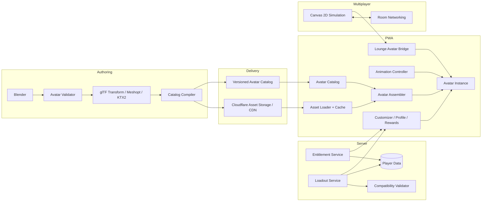
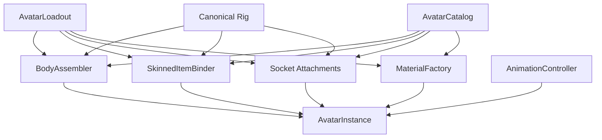

# Zoomigo 3D Avatar System — Technical Architecture

**Status:** Proposed  
**Companion document:** `intent.md`  
**Primary target:** Zoomigo player PWA and multiplayer team lounge  
**Primary users:** The current product serves youth players, roughly ages 9–12;
this audience does not impose one permanent age or body proportion on every
future avatar family.

---

## 1. Purpose

This document defines the technical foundation for the new Zoomigo avatar system.

The system should support:

- animated 3D player avatars
- a large catalog of interchangeable cosmetic items
- unlockable clothing, accessories, animations, props, and effects
- one persistent player appearance used throughout Zoomigo
- mobile-friendly rendering
- multiplayer lounge presence
- team and seasonal cosmetics
- safe, curated customization
- a content pipeline that can grow to hundreds or thousands of items

The architecture should make **adding content cheap** and **runtime behavior predictable**.

The system should not require a server-side 3D renderer, server-side physics for cosmetics, or a third-party avatar platform.

---

# 2. Existing Zoomigo Architecture Assumptions

This design assumes the current Zoomigo direction remains in place:

- Zoomigo is a browser-based PWA.
- The multiplayer lounge already has a 2D simulation and networking model.
- Lounge physics and authoritative object state remain separate from avatar presentation.
- Zoomigo already has an API and persistent player data.
- Static application assets can be delivered through Cloudflare-backed storage/CDN.
- Cosmetic rewards come from Zoomigo progression and reward systems.

The avatar system should fit into those systems rather than replace them.

---

# 3. Architecture Principles

## 3.1 Own the avatar format

Zoomigo should own:

- the rig
- the equipment slots
- the cosmetic catalog
- the animation naming contract
- the compatibility rules
- the unlock rules
- the rendered style

Do not make Ready Player Me, VRM, or another avatar SaaS the canonical data model.

This keeps Zoomigo in control of:

- child safety
- available appearance choices
- reward design
- asset size
- art direction
- performance
- team-specific content
- future licensing

An external model or animation source may be used during content creation, but all shipped content must be converted into the Zoomigo avatar contract.

---

## 3.2 Use open runtime formats

Use **glTF 2.0 / GLB** as the shipping format for:

- meshes
- skins
- skeletons
- materials
- textures
- morph targets
- animation clips

GLB should be the default package format because it can contain a complete runtime asset in one binary file.

The content pipeline may begin with Blender files or another authoring format, but source formats are not runtime formats.

---

## 3.3 Keep simulation and presentation separate

The multiplayer engine owns:

- X/Y position
- velocity
- facing
- collision
- item interaction
- room state
- player presence

The avatar system owns:

- 3D model
- appearance
- animation
- visual effects
- cosmetic props
- presentation LOD

The network should never send:

- bone transforms
- mesh state
- texture state
- frame-by-frame animation state

The avatar runtime derives animation from the existing simulation state.

Example:

```text
Canvas velocity = 0
        ↓
Avatar animation = idle

Canvas velocity > walk threshold
        ↓
Avatar animation = walk

Canvas velocity > run threshold
        ↓
Avatar animation = run
```

---

## 3.4 Cosmetics never affect gameplay

A hat, shoe, backpack, animation, or effect must not change:

- collision shape
- movement speed
- physics mass
- interaction range
- multiplayer authority
- workout rewards

The avatar is a presentation layer.

---

# 4. Technology Decisions

## 4.1 Runtime renderer: Three.js

Use **Three.js** as the core 3D runtime.

Required Three.js features include:

- `GLTFLoader`
- `KTX2Loader`
- `MeshoptDecoder`
- `AnimationMixer`
- `AnimationAction`
- `SkinnedMesh`
- `SkeletonUtils`
- `LOD`
- `BufferGeometryUtils`
- standard cameras, lights, materials, and render targets

### Why Three.js

Three.js gives Zoomigo:

- a mature browser 3D runtime
- direct glTF support
- skeletal animation
- mobile WebGL support
- WebGPU migration support
- compressed texture support
- geometry and animation compression support
- no dependency on a game-engine runtime

The core avatar package should use Three.js directly.

---

## 4.2 React Three Fiber: optional adapter only

If the Zoomigo PWA uses React, `@react-three/fiber` may be used in UI surfaces such as:

- avatar customizer
- reward reveal screen
- profile viewer

However:

> `@zoomigo/avatar-runtime` must not depend on React Three Fiber.

The core runtime should stay framework-neutral so it can also power the multiplayer lounge and any future non-React surface.

Suggested layering:

```text
React UI
   ↓
@zoomigo/avatar-react      optional
   ↓
@zoomigo/avatar-runtime
   ↓
Three.js
```

If the player PWA is not React-based, skip the React adapter completely.

---

## 4.3 Rendering backend

Start with a renderer abstraction:

```ts
interface AvatarRenderBackend {
  initialize(canvas: HTMLCanvasElement): Promise<void>;
  render(scene: THREE.Scene, camera: THREE.Camera): void;
  resize(width: number, height: number, dpr: number): void;
  dispose(): void;
}
```

Preferred implementation:

- Three.js `WebGPURenderer` where stable in the target browser
- automatic WebGL 2 fallback

The avatar system must not require WebGPU.

A WebGL-only fallback remains mandatory for supported mobile devices.

---

## 4.4 Asset format: glTF 2.0 / GLB

All runtime character assets should ship as GLB.

Use the glTF coordinate conventions:

- right-handed
- +Y is up
- +Z is forward
- meters as the linear unit

Each avatar family should use one canonical rest pose and one canonical skeleton
hierarchy. Different families may use different rigs.

Recommended rest pose:

**A-pose**

A-pose gives better default shoulder deformation for clothing than a full T-pose while remaining simple for rigging.

---

## 4.5 Geometry compression: Meshopt

Standardize on **Meshopt** for shipped avatar geometry.

Use `EXT_meshopt_compression`.

Reasons:

- supported by Three.js `GLTFLoader`
- works with geometry
- works with morph targets
- can compress animation data
- integrates with glTF Transform
- avoids shipping multiple mesh decoder paths

Do not mix Draco and Meshopt without a measured reason.

Draco can remain available for special cases, but it should not be the normal avatar pipeline.

---

## 4.6 Texture compression: KTX2 + Basis Universal

Use **KTX2** for production avatar textures.

Three.js should load these through `KTX2Loader`.

Target:

- ETC1S for highly compressible color textures
- UASTC for textures where quality matters more, such as normals

The loader chooses a GPU-compatible compressed texture format for the device.

This reduces:

- network size
- GPU memory use
- texture upload cost

---

## 4.7 Asset optimization: glTF Transform

Use the `@gltf-transform/*` toolchain during CI.

Recommended packages:

```text
@gltf-transform/core
@gltf-transform/extensions
@gltf-transform/functions
@gltf-transform/cli
meshoptimizer
sharp
```

Typical build operations:

1. validate
2. deduplicate
3. prune unused data
4. resample animations
5. quantize
6. optimize geometry
7. apply Meshopt compression
8. resize textures
9. convert textures to KTX2
10. emit production GLB
11. calculate hashes
12. update catalog manifest

The pipeline should be deterministic.

The same source input plus tool versions should create the same logical output.

---

## 4.8 Authoring tool: Blender

Use Blender as the reference content-authoring tool.

Blender source files may contain:

- one family's canonical rig
- base body
- clothing
- hair
- props
- sockets
- animation actions
- LOD meshes
- material sources

Export to glTF/GLB before runtime optimization.

Blender files should never ship to clients.

---

# 5. Recommended Dependency Set

| Library / technology         | Role                                                |     Required |
| ---------------------------- | --------------------------------------------------- | -----------: |
| `three`                      | 3D rendering and animation                          |          Yes |
| Three `GLTFLoader`           | GLB loading                                         |          Yes |
| Three `KTX2Loader`           | GPU texture loading                                 |          Yes |
| `meshoptimizer`              | Meshopt decoding and build optimization             |          Yes |
| Three `SkeletonUtils`        | Correct cloning/retarget support for skinned meshes |          Yes |
| Three `BufferGeometryUtils`  | Build-time/runtime geometry assembly where useful   |          Yes |
| `@gltf-transform/core`       | Asset processing                                    |   Build only |
| `@gltf-transform/extensions` | glTF extensions                                     |   Build only |
| `@gltf-transform/functions`  | Optimization transforms                             |   Build only |
| `@gltf-transform/cli`        | CI asset pipeline                                   |   Build only |
| `sharp`                      | Texture resize/processing                           |   Build only |
| Blender                      | Modeling, rigging, animation                        | Content only |
| `@react-three/fiber`         | React rendering adapter                             |     Optional |
| Playwright                   | Browser integration and visual tests                |  Recommended |

Pin exact package versions in the repository lockfile.

Do not encode package versions into the architecture contract.

---

# 6. Do Not Use as the Core Architecture

## Ready Player Me or another hosted avatar builder

Do not make a hosted avatar service the source of truth.

Reasons:

- unlock inventory becomes tied to another catalog
- art style is harder to control
- asset performance is harder to guarantee
- content and privacy policies are outside Zoomigo's full control
- team-specific rewards become harder to author
- long-term product dependency

---

## VRM as the canonical format

VRM is useful for interoperable humanoid avatars, but Zoomigo does not need arbitrary imported humanoids.

Zoomigo needs:

- one optimized, internally consistent rig per production family
- predictable clothing attachment
- curated child-safe content
- strict mobile budgets

Use standard glTF and a Zoomigo-specific manifest instead.

VRM import could be explored later as an authoring tool, not a runtime requirement.

---

# 7. Versioned Avatar Families and Rigs

The runtime must not assume every character is human. An **avatar family** owns
one compatible body, rig, body-region, attachment, and animation contract.

The first production family is the ZoomiGo youth biped:

```text
family.zoomigo-humanoid-v1
  rig: zoomigo-humanoid-v2
```

`zoomigo-humanoid-v1` is the engineering-spike rig, not the artist production
reference. The artist-created v2 rig is frozen only after its base mesh,
deformation, sockets, fit envelopes, and pose library pass the foundation gate.

Every body and skinned cosmetic targets one explicit family and that family's
locked rig. A non-human family may use a completely different skeleton.
Future humanoid families may likewise use different bodies and rig versions for
different ages, heights, builds, or proportions. Do not apply arbitrary runtime
scaling to make the locked v2 body stand in for all human variation. Clothing
fit remains reliable because each family stays internally consistent.

---

## 7.1 Rig constraints

Target:

- no more than roughly 60 deform bones
- maximum 4 bone influences per vertex
- stable bone names
- stable joint ordering
- stable inverse bind matrices
- no root-motion requirement
- one common A-pose
- one common scale

Finger articulation is optional.

If finger bones are included, keep them in the canonical rig from the start so future animations do not require a breaking rig version.

---

## 7.2 Required logical bones

At minimum:

```text
root
hips

spine_01
spine_02
chest
neck
head

clavicle_l
upper_arm_l
lower_arm_l
hand_l

clavicle_r
upper_arm_r
lower_arm_r
hand_r

upper_leg_l
lower_leg_l
foot_l
toe_l

upper_leg_r
lower_leg_r
foot_r
toe_r
```

Additional twist, face, finger, or helper bones may exist if they stay within the performance budget. They are frozen with that family rig version.

---

## 7.3 Attachment sockets

Add named transform nodes for rigid cosmetics.

Example sockets:

```text
socket_head
socket_face
socket_back
socket_chest
socket_wrist_l
socket_wrist_r
socket_hand_l
socket_hand_r
socket_foot_l
socket_foot_r
socket_fx_root
```

Rigid items attach to sockets rather than being skinned.

Examples:

- hat → `socket_head`
- glasses → `socket_face`
- backpack → `socket_back`
- held soccer ball → `socket_hand_r`

Sockets expose semantic capabilities. A non-human family may map
`held.primary` to `socket_hand_r` even when the visual attachment is a gripper,
mouth, magnet, or other approved structure. Families declare only the sockets
they can support cleanly.

## 7.4 Non-human families

A robot, quadruped, bird, floating creature, or mascot may define its own:

- skeleton and rest pose;
- deform-bone budget;
- body coverage regions;
- attachment sockets;
- fitted cosmetics;
- family-specific implementations of shared animation roles.

Common animation roles are semantic. `motion.walk` means normal locomotion and
may be implemented as walking, rolling, hopping, hovering, or another approved
movement. Cross-family cosmetics are normally rigid socket items with a
reviewed placement per family. Skinned garments are not retargeted across
families by default.

The initial non-human proof family is `family.zoomigo-mascot-v1`. It validates
the capability boundary before non-human content is treated as a production
catalog commitment.

---

# 8. Avatar Asset Types

Every catalog item has one of a small number of runtime types.

## 8.1 Base body

Contains:

- skeleton
- body meshes
- default materials
- face
- default fallback appearance
- sockets

---

## 8.2 Skinned cosmetic

Used for items that deform with the body.

Examples:

- shirts
- jackets
- shorts
- pants
- socks
- shoes
- some hair styles

A skinned cosmetic:

- must use its target family's canonical skeleton
- must use that family's canonical joint order
- must pass bind-matrix validation
- must not add gameplay geometry

---

## 8.3 Socket cosmetic

Used for rigid or mostly rigid items.

Examples:

- hats
- glasses
- backpacks
- bracelets
- held props

These are cheaper than skinned cosmetics.

Prefer socket items when the result looks correct.

---

## 8.4 Material variant

A material variant changes appearance without changing geometry.

Examples:

- shirt color
- shoe color
- jersey color
- team color
- fabric pattern

Material variants should be favored because they create many combinations with little extra geometry.

---

## 8.5 Animation unlock

An animation item references a named animation clip.

Examples:

- celebration
- idle pose
- wave
- dance
- ball juggle
- entrance

Each animation export targets one family's canonical rig while implementing a
shared semantic clip role.

---

## 8.6 Effect unlock

Effects are small presentation recipes.

Examples:

- star burst after a celebration
- small movement trail
- team-color pulse
- soccer-ball particles

Effects must be bounded by device-performance settings.

Do not allow arbitrary downloaded shader code.

---

# 9. Body Coverage and Clothing Clipping

Clothing clipping is one of the main technical risks.

The architecture must handle it intentionally.

---

## 9.1 Body regions

Split the base body into logical regions at authoring time.

Example:

```text
head_neck
torso
pelvis
upper_arm_l
upper_arm_r
lower_arm_l
lower_arm_r
hand_l
hand_r
upper_leg_l
upper_leg_r
lower_leg_l
lower_leg_r
foot_l
foot_r
```

Each wearable declares which body regions it covers.

Example:

```json
{
  "id": "top.long-sleeve.001",
  "hideBodyRegions": [
    "torso",
    "upper_arm_l",
    "upper_arm_r",
    "lower_arm_l",
    "lower_arm_r"
  ]
}
```

---

## 9.2 Body assembler

The runtime should build one visible body mesh from the currently exposed regions.

Module:

```text
BodyAssembler
```

Responsibilities:

1. determine visible regions
2. merge compatible body geometry
3. preserve skin indices and skin weights
4. bind the result to the avatar skeleton
5. rebuild only when the loadout changes

Do not merge body geometry every animation frame.

This reduces clipping without forcing every body section to become its own permanent draw call.

---

## 9.3 Compatibility rules

Items may declare:

```text
requiresTags
excludesTags
hideSlots
hideBodyRegions
```

Examples:

- a large helmet may hide tall hair
- a full costume may replace top and bottom
- a backpack may conflict with a cape
- glasses may remain compatible with most headwear

The catalog resolves this before rendering.

The runtime should never guess item compatibility from mesh shape.

---

# 10. Cosmetic Slot Model

Recommended starting slots:

```text
hair
face
top
bottom
socks
feet
headwear
eyewear
back
wrist_l
wrist_r
held
full_body
```

Animation selections:

```text
idle
celebration
entrance
reaction
```

Optional later slots:

```text
outerwear
neck
handwear
companion
trail
aura
```

Do not expose all future slots in the MVP UI.

The schema may support them before the UI does.

---

# 11. Material and Color System

A large reward catalog should not require a unique texture for every color.

Support three material modes.

---

## 11.1 Fixed

The item uses its authored material.

```text
materialMode = fixed
```

Best for:

- graphic tees
- mascot gear
- special event items

---

## 11.2 Single tint

The item has a neutral texture and one palette color.

```text
materialMode = tint1
```

Best for:

- basic shirts
- shorts
- socks
- shoes

This should exist in the MVP.

---

## 11.3 Multi-zone palette

Later, support a mask with up to three color regions.

```text
materialMode = palette3
```

Example:

```text
R channel = primary color
G channel = secondary color
B channel = trim
```

This supports team jerseys and high-volume variants without duplicating textures.

Implement this through one Zoomigo-owned material module rather than item-specific shaders.

Module:

```text
AvatarMaterialFactory
```

---

# 12. Face and Skin Appearance

Keep structural appearance simple.

Recommended model:

- curated skin-tone palette
- curated graphic face-feature sets
- curated eye/brow combinations
- hair mesh swaps
- a foundation-approved expression implementation

Do not build:

- height sliders
- weight sliders
- chest/waist sliders
- realistic body proportions
- body-shape scoring

The runtime expression contract is semantic:

```text
blink_l
blink_r
smile
mouth_open
surprised
```

Before `zoomigo-humanoid-v2` is locked, technical art must evaluate a minimal
mesh-morph system, a graphic feature geometry or material-state system, and a
hybrid of limited morphs with graphic eye, brow, and mouth treatments. The
selected approach must combine cleanly, export through GLB, and remain readable
at customizer and lounge review sizes.

The checked-in submission schema and current runtime are technique-neutral.
Morph-target compatibility remains supported until a deliberate schema and
runtime change replaces it. When morphs are used, preserve the semantic names
above and their `0..1` behavior. A non-morph implementation must map the same
semantics without weakening browser validation.

---

# 13. Animation Architecture

Use Three.js `AnimationMixer`.

Each `AvatarInstance` gets one animation mixer.

---

## 13.1 Animation packs

Organize animations into GLB packs.

Example:

```text
anim-core-v1.glb
  idle_default
  walk
  run
  turn_left
  turn_right

anim-celebrations-01.glb
  celebration_airplane
  celebration_jump
  celebration_fistpump

anim-idles-01.glb
  idle_ball_tap
  idle_stretch
  idle_bounce
```

This prevents each cosmetic from carrying duplicate animation data.

---

## 13.2 Root motion

All lounge locomotion animations should be **in place**.

Do not use animation root motion to move a player.

The Canvas simulation remains the movement authority.

---

## 13.3 Animation state machine

Module:

```text
AvatarAnimationController
```

Inputs:

```ts
interface AvatarMotionInput {
  speed: number;
  facingRadians: number;
  grounded: boolean;
  emote?: AvatarEmoteEvent;
  interaction?: AvatarInteractionState;
}
```

Basic state graph:

```text
              ┌─────────┐
       speed  │         │
     ┌───────►│  WALK   │───────┐
     │        │         │       │ faster
     │        └─────────┘       ▼
┌─────────┐                 ┌─────────┐
│         │                 │         │
│  IDLE   │                 │   RUN   │
│         │                 │         │
└─────────┘                 └─────────┘
     ▲                           │
     └───────────────────────────┘
              slow/stop
```

One-shot states such as celebration temporarily override locomotion.

---

## 13.4 Crossfading

Use `AnimationAction.crossFadeTo()` or equivalent blending.

Suggested transition windows:

```text
idle ↔ walk: 100–200 ms
walk ↔ run: 100–200 ms
locomotion → emote: 100–250 ms
emote → locomotion: 100–250 ms
```

Tune through testing rather than treating these values as hard protocol.

---

## 13.5 Multiplayer emotes

An emote network event should be compact.

Example:

```json
{
  "type": "avatar.emote",
  "playerId": "p_123",
  "clipId": "celebration.fistpump",
  "startedAt": 1788493200123
}
```

Peers play the clip locally.

No animation keyframes are sent.

---

# 14. Core Client Modules

Recommended package:

```text
@zoomigo/avatar-runtime
```

It should contain the following modules.

---

## 14.1 `AvatarCatalog`

Loads and indexes avatar definitions.

Responsibilities:

- item lookup
- slot lookup
- collection lookup
- variant lookup
- compatibility checks
- rig-version checks
- asset URL resolution

---

## 14.2 `AvatarAssetLoader`

Wraps Three.js loaders.

Responsibilities:

- GLB loading
- KTX2 setup
- Meshopt setup
- decoded asset caching
- loading cancellation
- errors and retry policy
- telemetry

---

## 14.3 `AvatarResourceCache`

Two cache layers:

### Browser asset cache

Persist downloaded binary assets through the existing PWA service worker and Cache API.

### Runtime memory cache

Keep parsed:

- geometry
- materials
- textures
- animation clips

shared between avatar instances when possible.

Avoid downloading or decoding the same shirt twenty times because twenty teammates wear it.

---

## 14.4 `AvatarRig`

Represents one instantiated skeleton.

Responsibilities:

- bone lookup
- socket lookup
- rig-version assertion
- rest-pose state
- skeleton lifecycle

---

## 14.5 `AvatarAssembler`

Input:

```text
AvatarLoadout
```

Output:

```text
AvatarInstance
```

Responsibilities:

- clone base rig
- build visible body
- bind skinned items
- attach socket items
- apply material variants
- configure face
- configure hair
- register animations
- apply LOD policy

---

## 14.6 `SkinnedItemBinder`

Loads a cosmetic authored against its declared family rig and binds it to the
live avatar skeleton.

Validation must ensure:

- identical bone identifiers
- compatible joint indices
- matching bind matrices
- allowed influence count

Do not run expensive animation retargeting for ordinary Zoomigo cosmetics.

All official skinned cosmetics should already use their target family's
canonical rig.

---

## 14.7 `AvatarMaterialFactory`

Creates and caches materials.

Responsibilities:

- fixed materials
- single-tint materials
- future multi-zone palette material
- skin-tone material
- quality-tier adjustments
- material sharing

---

## 14.8 `AvatarAnimationController`

Owns:

- AnimationMixer
- locomotion state
- emote state
- animation crossfades
- idle selection
- reduced-motion behavior
- offscreen animation throttling

---

## 14.9 `AvatarLODController`

Chooses detail level from:

- distance
- viewport size
- number of visible avatars
- device performance tier
- current UI context

Example contexts:

```text
hero
profile
reward
lounge-near
lounge-far
thumbnail
```

---

## 14.10 `AvatarInstance`

Public runtime object.

Example API:

```ts
interface AvatarInstance {
  readonly root: THREE.Object3D;

  setLoadout(loadout: AvatarLoadout): Promise<void>;

  setPosition(x: number, y: number, z?: number): void;

  setFacing(radians: number): void;

  setMotion(input: AvatarMotionInput): void;

  playEmote(emoteId: string): void;

  setQuality(tier: AvatarQualityTier): void;

  update(deltaSeconds: number): void;

  dispose(): void;
}
```

---

## 14.11 `AvatarPerformanceManager`

Global manager for a stage.

Responsibilities:

- frame-time sampling
- quality tier
- device pixel ratio cap
- animation update frequency
- avatar LOD
- effect limits
- optional shadow control

This should react to measured frame time rather than user-agent strings alone.

---

# 15. UI Modules

Recommended package:

```text
@zoomigo/avatar-ui
```

Framework-specific wrappers may live beside it.

---

## 15.1 Avatar customizer

Responsibilities:

- render hero avatar
- browse owned items
- preview locked items if product design allows
- filter by slot
- equip/unequip
- change variants
- save loadout
- show incompatibility before save

Changes should preview locally before the server request completes.

The server remains authoritative for the saved loadout.

---

## 15.2 Reward reveal

Input:

```text
RewardGranted
```

Behavior:

1. resolve item in catalog
2. prefetch asset
3. show avatar
4. temporarily equip or showcase item
5. allow player to equip it
6. return to prior screen

---

## 15.3 Profile viewer

A smaller stage that displays:

- current avatar
- idle animation
- selected celebration preview

This must reuse the same runtime.

Do not build a separate profile avatar implementation.

---

# 16. Multiplayer Lounge Integration

Recommended package:

```text
@zoomigo/avatar-lounge
```

---

## 16.1 Preserve the Canvas simulation

The current Canvas engine remains responsible for:

- room physics
- movement
- collision
- interaction
- interpolation
- teleport handling
- world state

The avatar bridge consumes its state.

---

## 16.2 `LoungeAvatarBridge`

Responsibilities:

```text
Canvas entity
    ↓
position
velocity
facing
presence
interaction
    ↓
AvatarInstance
```

Example:

```ts
bridge.updatePlayer({
  playerId,
  x,
  y,
  velocityX,
  velocityY,
  facing,
});
```

The bridge converts velocity to animation speed.

---

## 16.3 Coordinate projection

Add a strategy interface because Canvas supports more than one world style.

```ts
interface CanvasAvatarProjection {
  worldToAvatarTransform(
    canvasX: number,
    canvasY: number,
    facing: number,
  ): AvatarTransform;
}
```

Possible implementations:

```text
TopDownProjection
SideViewProjection
ScreenSpaceProjection
```

This keeps avatar logic independent of lounge art style.

---

## 16.4 Three-based lounge renderer

Long-term preferred path:

```text
Canvas physics/network state
          ↓
ThreeSceneRenderer
    ├── background plane
    ├── 2D item planes/sprites
    ├── 3D avatars
    ├── foreground planes
    └── effects
```

This keeps one compositing surface and solves ordering between 2D world items and 3D avatars.

The 2D item engine does not need to become 3D physics.

A sprite can remain a flat plane inside a Three.js scene.

---

## 16.5 Transitional lounge support

Do not block the avatar MVP on a full lounge renderer migration.

Roll out in this order:

1. customizer
2. profile
3. reward reveal
4. 3D single-player preview
5. lounge renderer adapter
6. full-team lounge

The existing avatar representation can remain the lounge fallback until the new stage passes the 20-player performance test.

---

# 17. Multiplayer Appearance Sync

Do not include full avatar loadout in every movement packet.

At room join, send a compact appearance snapshot.

Example:

```json
{
  "playerId": "p_123",
  "avatarRevision": 17,
  "appearance": {
    "base": "base.zg-human-01",
    "skin": "skin.05",
    "hair": "hair.short-03",
    "top": "top.jersey-12:red",
    "bottom": "bottom.short-04:black",
    "feet": "feet.cleat-08:white",
    "headwear": null,
    "celebration": "anim.fistpump"
  }
}
```

Movement packets then need only normal player state.

When appearance changes:

```text
avatar.appearanceChanged
```

is sent once.

---

## 17.1 Appearance hash

Create a deterministic hash from the loadout.

Example:

```text
appearanceHash = SHA-256(canonicalized loadout)
```

Peers can use:

```text
playerId + avatarRevision + appearanceHash
```

to determine whether anything actually changed.

Do not use the hash as an authorization mechanism.

---

# 18. Catalog Architecture

The cosmetic catalog should be **content-driven**, not hard-coded.

Source example:

```text
content/avatar/
  catalog/
    bases.json
    hair.json
    tops.json
    bottoms.json
    shoes.json
    accessories.json
    animations.json
    effects.json
    collections.json
```

CI compiles these into:

```text
avatar-catalog.<version>.json
```

---

## 18.1 Catalog item schema

Example:

```json
{
  "id": "top.street-jersey.001",
  "version": 1,
  "displayName": "Street Striker Jersey",
  "kind": "skinned",
  "slot": "top",
  "familyTargets": ["family.zoomigo-humanoid-v1"],
  "rigVersion": "zoomigo-humanoid-v2",

  "assets": {
    "lod0": {
      "url": "/avatar/assets/a91f....glb",
      "sha256": "a91f...",
      "bytes": 184221
    },
    "lod1": {
      "url": "/avatar/assets/11bc....glb",
      "sha256": "11bc...",
      "bytes": 94112
    }
  },

  "hideBodyRegions": ["torso"],

  "materialMode": "tint1",

  "variants": ["red", "maroon", "white", "orange"],

  "tags": ["soccer", "street"],

  "collectionId": "street-soccer",

  "active": true
}
```

---

## 18.2 Stable IDs

Item IDs are permanent.

Do not reuse an ID for a different item.

Bad:

```text
top.001
```

Better:

```text
top.street-jersey.001
```

If an item changes in an incompatible way, create a new item revision or ID.

---

# 19. Content-addressed Assets

Production asset URLs should contain a content hash.

Example:

```text
/avatar/assets/sha256-a91f4c....glb
```

Benefits:

- immutable caching
- safe long cache lifetimes
- no stale replacement problem
- easy rollback
- easy catalog versioning

The catalog points to the current hash.

---

# 20. Asset Delivery

Use existing Cloudflare-backed object storage for:

```text
/avatar/catalog/
/avatar/assets/
/avatar/textures/
/avatar/thumbnails/
```

Assets are generic cosmetic content.

They do not need to be secret.

Authorization protects:

- whether a player owns an item
- whether a player can equip it

Do not treat an obscure GLB URL as entitlement security.

---

# 21. PWA Caching

Use the existing service worker.

Avatar assets should use cache-first behavior once fetched because their URLs are immutable.

Recommended categories:

```text
core avatar rig       precache
core animations       precache or early prefetch
equipped cosmetics    high-priority cache
owned cosmetics       on demand
locked cosmetics      metadata only until preview
seasonal catalog      on demand
```

Do not precache the entire cosmetic library.

---

# 22. Runtime Loading Strategy

When showing an avatar:

### Phase 1

Load:

- catalog
- core rig
- base body
- core idle animation

Render the default or last-known avatar quickly.

### Phase 2

Load equipped:

- hair
- top
- bottom
- shoes

### Phase 3

Load optional:

- accessories
- custom animations
- effects

The avatar should appear before every optional item finishes downloading.

---

# 23. Server Data Model

The avatar service has two kinds of persistent state:

1. ownership
2. current loadout

Catalog metadata remains content-managed.

---

## 23.1 Entitlement model

If Zoomigo already has a generic reward or entitlement ledger, use it.

Do not create an avatar-only reward system unless needed.

Logical record:

```text
player_id
reward_type
content_id
source_type
source_id
granted_at
revoked_at
```

Example:

```text
player_123
avatar_item
top.street-jersey.001
workout_streak
streak_7_day
2026-09-03T20:14:00Z
null
```

---

## 23.2 Avatar loadout

Suggested logical shape:

```text
player_id
family_id
rig_version
loadout_json
revision
updated_at
```

`revision` provides optimistic concurrency.

---

## 23.3 Loadout schema

Example:

```json
{
  "schemaVersion": 1,
  "familyId": "family.zoomigo-humanoid-v1",
  "rigVersion": "zoomigo-humanoid-v2",
  "baseId": "base.player-biped-v2",

  "appearance": {
    "skinToneId": "skin.05",
    "faceId": "face.03",
    "hairId": "hair.short-03"
  },

  "slots": {
    "top": {
      "itemId": "top.street-jersey.001",
      "variantId": "maroon"
    },
    "bottom": {
      "itemId": "bottom.short.004",
      "variantId": "black"
    },
    "feet": {
      "itemId": "feet.cleat.008",
      "variantId": "white"
    }
  },

  "animations": {
    "idle": "anim.idle.default",
    "celebration": "anim.celebration.fistpump"
  },

  "effects": []
}
```

---

# 24. Server Modules

Recommended logical modules:

```text
AvatarCatalogProvider
AvatarLoadoutService
AvatarEntitlementService
AvatarCompatibilityValidator
AvatarRewardAdapter
AvatarPresenceMapper
```

---

## 24.1 `AvatarCatalogProvider`

Responsibilities:

- load current compiled catalog
- lookup item
- lookup variants
- validate active status
- validate rig version

The server does not need GLB data.

It only needs metadata.

---

## 24.2 `AvatarLoadoutService`

Responsibilities:

- get loadout
- validate proposed loadout
- save loadout
- increment revision
- publish appearance-changed event

---

## 24.3 `AvatarEntitlementService`

Responsibilities:

- determine whether an item is usable
- grant items from trusted reward flows
- optionally revoke an item
- return owned item IDs

The client cannot grant entitlements.

---

## 24.4 `AvatarCompatibilityValidator`

Validates:

- slot
- ownership
- active item
- allowed variant
- rig version
- item conflicts
- required items
- blocked combinations

The same rules should also run in the client for instant feedback.

Server validation remains authoritative.

---

# 25. Suggested API

Exact routes should follow existing Zoomigo API style.

Logical operations:

---

## Get current avatar

```http
GET /avatar/me
```

Response:

```json
{
  "revision": 17,
  "loadout": {},
  "ownedItemIds": [],
  "catalogVersion": "2026.09.1"
}
```

---

## Save loadout

```http
PUT /avatar/me
```

Request:

```json
{
  "expectedRevision": 17,
  "loadout": {}
}
```

Response:

```json
{
  "revision": 18,
  "loadout": {}
}
```

---

## Get team appearances

```http
GET /teams/{teamId}/avatar-appearances
```

Return compact loadouts or appearance snapshots.

Only return players visible through the existing team-access rules.

---

## Grant reward

Internal trusted operation:

```text
grantAvatarItem(playerId, itemId, source)
```

Do not expose an unrestricted player-facing grant endpoint.

---

# 26. Reward Flow

Example workout reward:

```text
Workout completed
       ↓
Reward policy evaluates
       ↓
Avatar item selected
       ↓
Entitlement granted
       ↓
RewardGranted event
       ↓
Player response includes reward
       ↓
PWA resolves catalog item
       ↓
Asset prefetched
       ↓
Reward reveal
       ↓
Player may equip item
```

The reward system grants an **item ID**, not a GLB URL.

---

# 27. Performance Budgets

The system must be designed around a full team, not a single desktop demo.

These are initial engineering targets and should be adjusted through profiling.

---

## 27.1 Fully equipped avatar

### LOD0 — hero/customizer

Target:

```text
≤ 25k triangles
≤ 60 deform bones
≤ 4 bone influences per vertex
≤ 8 draw calls
≤ 2 materials per cosmetic
1024px texture maximum in normal cases
```

---

## 27.2 LOD1 — near lounge

Target:

```text
≤ 12k triangles
≤ 6 draw calls
512px effective texture target
```

---

## 27.3 LOD2 — far lounge

Target:

```text
≤ 4k triangles
minimal accessories
reduced animation update rate
no cosmetic VFX
```

---

## 27.4 Team scene

Target test:

```text
20 visible avatars
50 ordinary Canvas items
5 complex physics objects
common modern phone
30 FPS minimum target
```

A 60 FPS path is desirable, but the system should remain usable at 30 FPS.

---

# 28. Adaptive Quality

Define:

```ts
type AvatarQualityTier = "high" | "medium" | "low";
```

---

## High

- LOD0/LOD1
- full animation rate
- small VFX
- higher device-pixel ratio

---

## Medium

- LOD1
- reduced VFX
- capped device-pixel ratio
- far-avatar animation throttling

---

## Low

- LOD1/LOD2
- no VFX
- no dynamic shadows
- 30 FPS animation target
- lower device-pixel ratio

---

# 29. Animation Update Throttling

Not every remote avatar needs a 60 Hz animation update.

Example policy:

```text
local player           every render frame
near remote player     30 Hz
far remote player      15 Hz
offscreen player       paused or 5 Hz
```

Positions continue to use existing multiplayer interpolation.

This is a presentation optimization only.

---

# 30. Lighting

Use a cheap, stable stylized lighting setup.

Recommended:

- ambient or hemisphere light
- one key directional light
- no per-avatar lights
- no real-time shadows in the lounge
- optional blob/contact shadow in hero views

Avoid expensive post-processing in full-team scenes.

---

# 31. Resource Lifecycle

3D resources need explicit ownership.

`AvatarResourceCache` should reference-count or otherwise track:

- geometries
- textures
- materials
- animation clips

`AvatarInstance.dispose()` must release instance-only resources.

Shared cached geometry should not be destroyed when one avatar leaves a room.

Handle browser `webglcontextlost` and restoration.

---

# 32. Thumbnail Strategy

The catalog UI should not render dozens of live 3D avatars at once.

Generate static thumbnails during the content pipeline.

Example:

```text
top.street-jersey.001.thumb.webp
```

Use live 3D only for:

- active avatar preview
- focused item preview
- reward reveal
- lounge

This keeps wardrobe browsing cheap.

---

# 33. Content Pipeline

Recommended source flow:

```text
Blender source
      ↓
GLB export
      ↓
Zoomigo validator
      ↓
glTF Transform optimization
      ↓
Meshopt
      ↓
KTX2
      ↓
LOD checks
      ↓
thumbnail render
      ↓
content hash
      ↓
catalog build
      ↓
R2/CDN upload
```

---

# 34. Asset Validator

Create:

```text
tools/avatar-content/validate
```

The validator should fail CI when an asset violates the contract.

Checks:

- valid glTF 2.0
- expected rig version
- expected skeleton bones
- expected bone order
- matching inverse bind matrices
- ≤ 4 influences per vertex
- valid slot
- valid socket
- triangle budget
- draw-call/material budget
- texture dimension budget
- supported texture format
- supported glTF extensions only
- finite bounds
- expected origin
- expected scale
- animation clip names
- no root movement in locomotion clips
- no duplicate catalog ID
- valid body coverage regions
- valid compatibility tags

This validator is one of the most important modules in the whole system.

Without it, the cost of adding cosmetics will rise over time.

---

# 35. Catalog Compiler

Create:

```text
tools/avatar-content/build-catalog
```

Responsibilities:

1. read source catalog definitions
2. validate schemas
3. attach asset hashes
4. attach byte sizes
5. attach thumbnail URLs
6. verify referenced files exist
7. verify all item IDs are unique
8. verify collection references
9. emit immutable production manifest

Output:

```text
avatar-catalog.2026.09.1.json
```

---

# 36. Suggested Repository Layout

This is conceptual and can be adapted to the current repository structure.

```text
packages/
  avatar-schema/
    src/
      catalog.ts
      loadout.ts
      events.ts
      compatibility.ts

  avatar-runtime/
    src/
      AvatarInstance.ts
      AvatarAssembler.ts
      AvatarAssetLoader.ts
      AvatarResourceCache.ts
      AvatarRig.ts
      BodyAssembler.ts
      SkinnedItemBinder.ts
      AvatarMaterialFactory.ts
      AvatarAnimationController.ts
      AvatarLODController.ts
      AvatarPerformanceManager.ts

  avatar-ui/
    src/
      AvatarStage.ts
      AvatarCustomizer.ts
      AvatarRewardReveal.ts
      AvatarProfileViewer.ts

  avatar-lounge/
    src/
      LoungeAvatarBridge.ts
      CanvasAvatarProjection.ts
      AvatarPresenceSync.ts
      ThreeSceneRenderer.ts

tools/
  avatar-content/
    validate/
    optimize/
    thumbnails/
    build-catalog/

content/
  avatar/
    catalog/
    animations/
    collections/

server/
  avatar/
    catalog-provider
    loadout-service
    entitlement-service
    compatibility-validator
    reward-adapter
```

---

# 37. Shared Schema Package

Create a shared schema contract.

Recommended content:

```text
AvatarCatalog
AvatarItemDefinition
AvatarAssetReference
AvatarLoadout
AvatarAppearanceSnapshot
AvatarEmoteEvent
AvatarQualityTier
AvatarCompatibilityRule
RewardGranted
```

The client and server do not need to share the same language implementation.

The serialized JSON schema is the contract.

---

# 38. Failure Handling

The avatar should never prevent a player from using Zoomigo.

Fallback order:

1. requested loadout
2. loadout with invalid item removed
3. saved default Zoomigo avatar
4. existing 2D avatar/token fallback

Examples:

- missing hat → render without hat
- failed custom animation → use default animation
- incompatible catalog version → use default loadout
- 3D renderer unavailable → use 2D fallback
- KTX2 failure → optional uncompressed fallback only if packaged

Do not fail the workout screen because an avatar asset failed.

---

# 39. Offline Behavior

Because Zoomigo is a PWA:

- current equipped avatar should work offline after first load
- core rig should be cached
- core animation set should be cached
- equipped cosmetics should be cached
- changing to an uncached cosmetic while offline should be blocked or clearly deferred

Do not attempt to cache every owned item by default.

---

# 40. Accessibility

Runtime requirements:

- support `prefers-reduced-motion`
- reduce or disable idle flourish animations when requested
- suppress flashing effects
- do not encode unlock state by color alone
- customizer controls remain normal DOM controls
- 3D canvas is presentation, not the sole interaction surface

---

# 41. Security and Child Safety

The architecture should enforce the product intent.

Do not support:

- uploaded skin textures
- uploaded images
- free-form clothing text
- downloadable user-authored models
- arbitrary shader code
- public cosmetic trading
- cosmetic chat metadata

Catalog assets come only from approved Zoomigo content.

---

## 41.1 Server authority

The client may preview an item.

The server decides whether the player may save it.

Validation:

```text
item exists
AND item active
AND player owns item OR item is default/free
AND variant allowed
AND slot allowed
AND compatibility valid
```

---

# 42. Telemetry

Measure the system before optimizing blindly.

Suggested client metrics:

```text
avatar.core_load_ms
avatar.cosmetic_load_ms
avatar.assemble_ms
avatar.catalog_load_ms
avatar.asset_error
avatar.renderer_init_error
avatar.visible_count
avatar.triangle_estimate
avatar.draw_call_estimate
avatar.quality_tier
avatar.frame_time_ms
avatar.lod_distribution
avatar.context_lost
```

Product metrics:

```text
avatar.customizer_open
avatar.item_preview
avatar.item_equipped
avatar.reward_equipped
avatar.loadout_saved
avatar.item_usage_days
```

Do not collect unnecessary personal appearance inference.

---

# 43. Testing Strategy

## Unit tests

Test:

- catalog lookup
- slot rules
- item conflicts
- entitlement rules
- loadout validation
- appearance hashing
- animation state transitions

---

## Asset tests

Every asset PR runs:

- glTF validation
- Zoomigo rig validator
- budget checks
- manifest compile
- thumbnail generation
- load test

---

## Browser tests

Use Playwright for:

- load avatar
- change item
- save loadout
- reload loadout
- reward equip
- WebGL fallback
- reduced-motion behavior

---

## Visual regression

Maintain known test avatars.

Example:

```text
default
all-basic
long-sleeve
full-costume
large-headwear
team-kit
maximum-accessories
```

Capture consistent screenshots and compare them in CI.

This catches:

- clipping
- missing textures
- bad bind poses
- bad sockets
- material regressions

---

# 44. Performance Test Scene

Build a permanent internal test route:

```text
/dev/avatar-stress
```

Controls:

- visible avatar count
- cosmetic randomization
- animation rate
- LOD thresholds
- quality tier
- texture resolution
- VFX on/off
- device pixel ratio
- lounge item count

Presets:

```text
1 avatar — hero
5 avatars — small room
12 avatars — typical team
20 avatars — target max
20 avatars + 50 items — full stress
```

Do not approve lounge integration based on a one-avatar desktop demo.

---

# 45. Versioning

Three independent versions matter.

---

## Schema version

Example:

```text
AvatarLoadout schemaVersion = 1
```

Changes only when serialized player data changes.

---

## Rig version

Example:

```text
zoomigo-humanoid-v2
```

Changes when one family's skeleton compatibility breaks. Family identity and
rig version are separate: a family may move to a new rig version through an
explicit migration.

Avoid doing this often.

---

## Catalog version

Example:

```text
2026.09.1
```

Changes whenever content is published.

Catalog changes should not require an app deployment.

---

# 46. Rig Migration

If a `zoomigo-humanoid-v3` is ever required after the production v2 rig is
locked:

- v2 items remain v2
- v3 items declare v3
- loadout migration maps compatible item IDs
- v2 runtime support remains through a defined migration window
- do not silently bind v2 clothing to a changed v3 skeleton

Rig changes should be treated like API breaking changes.

---

# 47. Content Publishing

Recommended workflow:

```text
content PR
   ↓
asset validator
   ↓
visual regression
   ↓
performance checks
   ↓
catalog compiler
   ↓
review
   ↓
publish hashed assets
   ↓
publish new catalog
   ↓
activate catalog version
```

A bad catalog should be reversible without reverting the main PWA release.

---

# 48. Architecture Diagram



---

# 49. Avatar Runtime Diagram



---

# 50. MVP Scope

The first implementation should prove the architecture rather than produce a huge catalog.

Recommended MVP content:

### Base

- 1 canonical body/rig
- curated skin-tone palette
- 4–6 face options
- 6–8 hair options

### Clothing

- 5 tops
- 4 bottoms
- 4 shoes
- 3 headwear items
- 2 eyewear items
- 2 back items

### Variants

- basic color variants
- team maroon/white/orange set

### Animation

- default idle
- walk
- run
- 3 celebrations
- 2 alternate idles
- 2 reactions

### Surfaces

- avatar customizer
- profile avatar
- reward reveal
- persisted loadout
- unlock entitlement
- 3D lounge prototype
- 20-player stress route

---

# 51. MVP Technical Acceptance Criteria

The foundation is ready when all of these are true.

## Content

- a new cosmetic can be added without application code
- CI rejects an invalid cosmetic
- catalog publication does not require a PWA build
- content uses stable IDs
- assets use content hashes

## Player state

- owned cosmetics persist
- equipped cosmetics persist
- server blocks unowned equipment
- invalid combinations are rejected
- loadout revision prevents accidental overwrite

## Rendering

- the same loadout renders in customizer and profile
- the same runtime can render multiple avatars
- body/clothing clipping is controlled by coverage metadata
- animations crossfade cleanly
- assets are cached
- failed cosmetic assets degrade safely

## Multiplayer

- movement state drives locomotion animation
- no bones are sent over the network
- changing a loadout sends only a discrete appearance update
- cosmetics do not affect physics
- 20-avatar stress test is usable on the target mobile class

## Safety

- all content is catalog-controlled
- no user image upload exists
- no free-form cosmetic text exists
- avatar controls do not expose body-size ranking or scoring

---

# 52. Recommended Implementation Order

## Phase 1 — Runtime spike

Build:

- Three.js stage
- canonical rig
- GLB loader
- one base avatar
- AnimationMixer
- idle/walk/run
- simple loadout object

Goal:

Prove the rig, animation, and browser rendering path.

---

## Phase 2 — Modular equipment

Build:

- catalog schema
- AvatarAssembler
- SkinnedItemBinder
- socket items
- BodyAssembler
- tint variants
- compatibility rules

Goal:

Prove that many combinations within one locked family can share its rig.

---

## Phase 3 — Content pipeline

Build:

- Blender export conventions
- validator
- glTF Transform optimization
- Meshopt
- KTX2
- catalog compiler
- hashed publishing
- thumbnail generation

Goal:

Make content additions routine.

---

## Phase 4 — Persistent player system

Build:

- loadout API
- entitlement integration
- reward grant integration
- customizer
- save/equip flow
- offline cache

Goal:

Make cosmetics part of Zoomigo progression.

---

## Phase 5 — Shared product surfaces

Integrate:

- player profile
- workout completion
- prize/reward reveal
- team views where useful

Goal:

Make the avatar a shared identity across Zoomigo.

---

## Phase 6 — Lounge integration

Build:

- LoungeAvatarBridge
- coordinate projections
- appearance snapshot sync
- emote events
- Three-based lounge presentation
- quality manager
- LOD
- 20-player stress test

Goal:

Bring the same persistent avatar into multiplayer without changing room physics.

---

## Phase 7 — Content scale

Add:

- collections
- seasonal content
- team kits
- more animations
- palette3 material
- small effects
- improved LODs
- content analytics

Goal:

Grow the reward pool without growing application complexity.

---

# 53. Key Technical Risks

## Clothing clipping

Mitigation:

- canonical rig
- body coverage metadata
- strict validation
- test poses
- visual regression suite

---

## Too many draw calls

Mitigation:

- body merging
- low material count
- rigid socket items where possible
- LOD
- shared resources
- no live 3D catalog grid

---

## Large downloads

Mitigation:

- Meshopt
- KTX2
- on-demand cosmetics
- hashed immutable cache
- core package kept small

---

## Animation inconsistency

Mitigation:

- one locked rig per avatar family
- named animation contract
- in-place locomotion
- standard export process
- no per-item animation retargeting

---

## Mobile GPU load

Mitigation:

- no lounge shadows
- quality tiers
- LOD
- animation throttling
- limited effects
- frame-time-driven degradation

---

## Content production becoming expensive

Mitigation:

- strict asset templates
- automated validator
- reusable materials
- color variants
- socket accessories
- stable rig
- catalog-driven behavior

---

# 54. Decisions to Keep Stable

Once implementation begins, avoid casually changing these:

1. glTF/GLB as runtime asset format
2. versioned avatar families with one canonical rig per family
3. content-driven item IDs
4. server-authoritative entitlements
5. cosmetics separate from physics
6. no network bone replication
7. asset URLs are immutable/content-hashed
8. one avatar runtime shared by all product surfaces
9. asset validation in CI
10. 3D failure must never block normal Zoomigo use

These are the foundation that lets the rest of the avatar system grow safely.

---

# 55. Recommended First Engineering Deliverable

The first handoff should produce a vertical slice with:

```text
canonical rig
+ base body
+ 2 hairstyles
+ 2 shirts
+ 2 bottoms
+ 2 shoes
+ 1 hat
+ 1 tintable item
+ idle
+ walk
+ run
+ celebration
+ catalog JSON
+ AvatarAssembler
+ customizer test screen
+ asset validator
+ 20-avatar stress screen
```

No reward integration is required for the first spike.

The purpose is to prove:

- asset compatibility
- assembly
- animation
- browser performance
- content workflow

before the project spends time producing a large cosmetic library.

---

# 56. External Technical Basis

This architecture relies on stable features from these upstream projects:

- **glTF 2.0** — Khronos runtime 3D asset standard
- **KTX 2.0 / Basis Universal** — compressed GPU texture delivery
- **Three.js GLTFLoader** — glTF, Meshopt, and KTX2 loading
- **Three.js AnimationMixer** — independent skeletal animation playback and blending
- **Three.js SkeletonUtils** — correct cloning and optional retargeting of skinned objects
- **glTF Transform** — deterministic Node/CLI asset optimization
- **Blender glTF exporter** — mesh, skin, material, morph-target, and animation export

Reference documentation:

- https://registry.khronos.org/glTF/specs/2.0/glTF-2.0.html
- https://registry.khronos.org/KTX/specs/2.0/ktxspec.v2.html
- https://threejs.org/docs/pages/GLTFLoader.html
- https://threejs.org/docs/pages/KTX2Loader.html
- https://threejs.org/docs/pages/AnimationMixer.html
- https://threejs.org/docs/pages/module-SkeletonUtils.html
- https://gltf-transform.dev/
- https://docs.blender.org/manual/en/dev/addons/scene_gltf2.html

---

# 57. Final Architecture Summary

The Zoomigo avatar system should be built as a **modular 3D presentation platform**, not as a collection of one-off character models.

The core model is:

```text
Player unlocks item IDs
        ↓
Server stores entitlements and loadout
        ↓
Catalog maps item IDs to optimized assets
        ↓
Avatar runtime selects a family and assembles its canonical rig
        ↓
Three.js renders the result
        ↓
Animation is derived from app or lounge state
```

The central technical bet is simple:

> **Stable family contracts, modular assets, one shared runtime, data-driven rewards.**

That gives Zoomigo a large customization space without forcing non-human
characters onto a human skeleton or tying player state, multiplayer physics, or
application logic to each cosmetic item.
